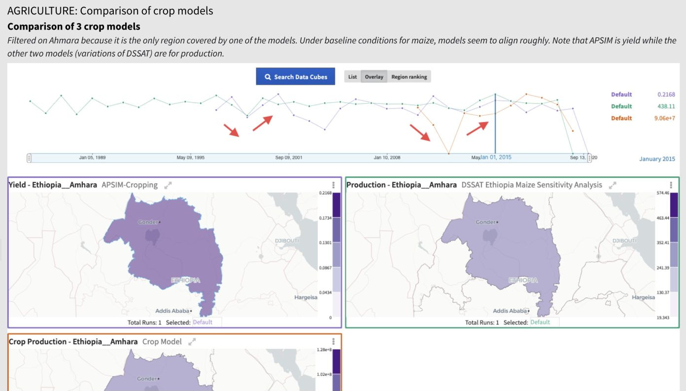
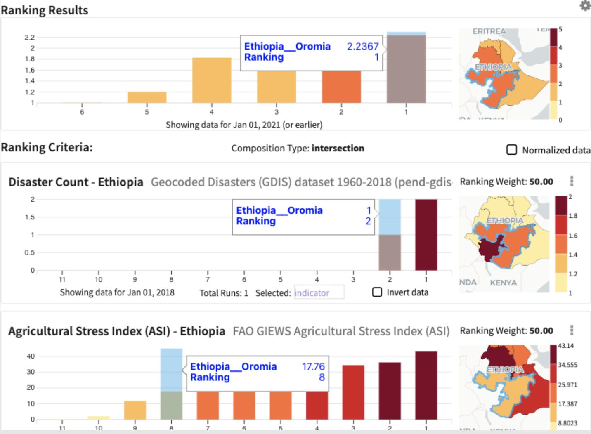

# Analysis Across Datacubes

Causemos supports several types of quantitative analyses across
datacubes, including:

-   **Overlay - Correlation Among Variables**: Determine whether an
    increase in *x* usually led to an increase or a decrease in *y*
    historically. When indicator *x* was particularly high/low
    historically, find the values of other indicators of interest
    (drivers/impacts).
    
-   **Overlay - Similar Models/Data Comparison**: Determine the
    similarity of the output of alternative models for comparable
    scenarios. Determine how similar the data is from different
    sources for a particular variable.
    
-   **Region Ranking**: Find which regions are currently best/worst with
    respect to variable(s) of interest.
    