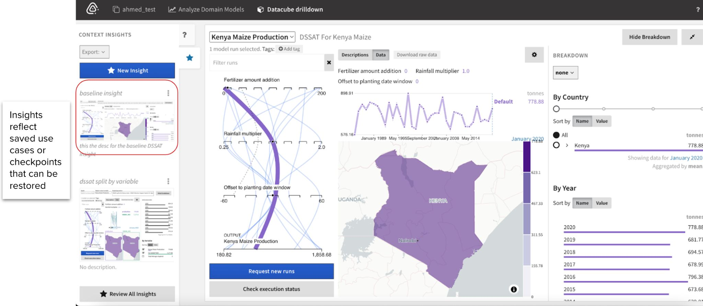
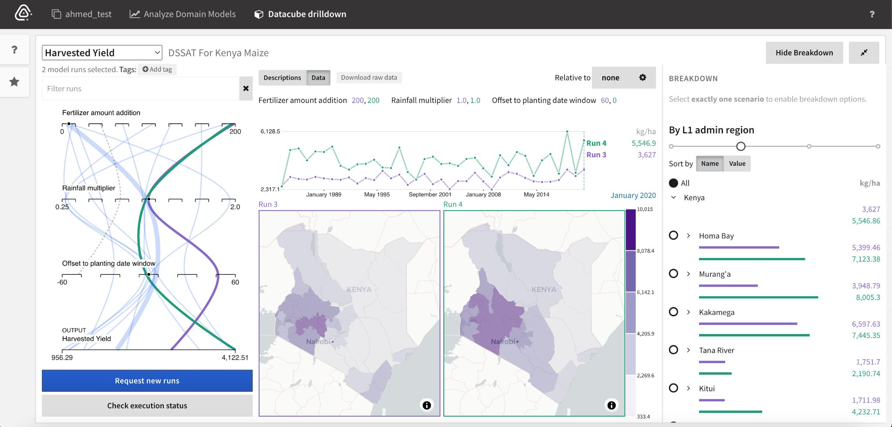

# Analysis Within a Domain Model Datacube

Explore and apply available model insights to deepen your understanding
of a domain model.

Select one or more scenarios of interest from the scenario explorer
(left) and compare the model output over time and space.

## Running Domain Models

Because domain models are inherently executable, the analyst can request
new model runs that cover new model scenarios with different parameter
values. In the new-runs mode, markers can be added on model parameters,
causing potential model scenarios to be generated, which may then be
reviewed prior to the actual execution.

