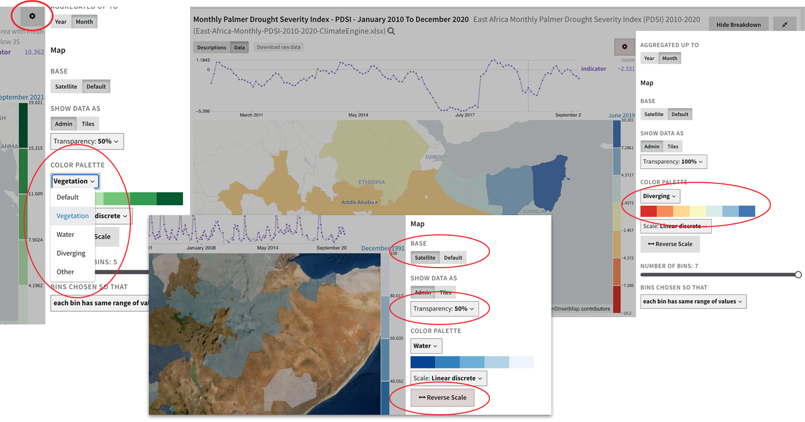

# Publishing Data

After registering a new dataset in Dojo, you will be able to jump to
Causemos to see the results and refine the presentation to appropriate
defaults for analysis use.

In Causemos, each whole dataset has one space where analysts can enrich
its metadata and configure visualization options (such as aggregation
functions) for one or all of its datacubes.

To enrich a dataset, you can edit any of its metadata, such as
descriptions, provenance information, and applicable domains. You can
also edit its indicator metadata. Indicators are data that indicate or
summarize the current or past state of something. They roll up
information into one element, such as GDP as an indicator of the economy
in a country during a calendar year.

Numerous visualization options for datasets include:

-   **Aggregation** (e.g. mean for an average or ratio, and sum for
    counts such as number of people).
    
-   **Units** (such as per capita, or normalized).
    
-   **Color Scales** to adjust how the data appears on the map.
    

The configuration of one indicator can be applied to the rest of the
indicators in the dataset if desired.