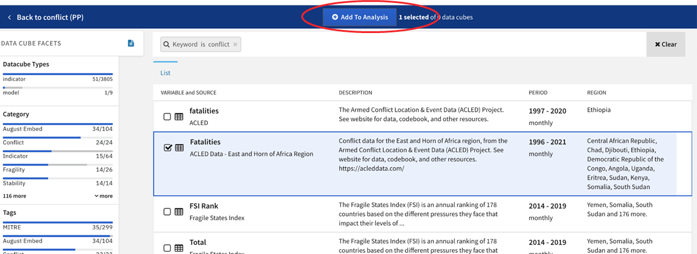

# Finding Data and Models (Data Explorer)

To work with data and quantitative models, analysts create a new
'Quantitative analysis' and click on 'Search datacubes'. This opens the
Data Explorer which helps analysts find relevant data and models to
leverage during quantitative analysis.

