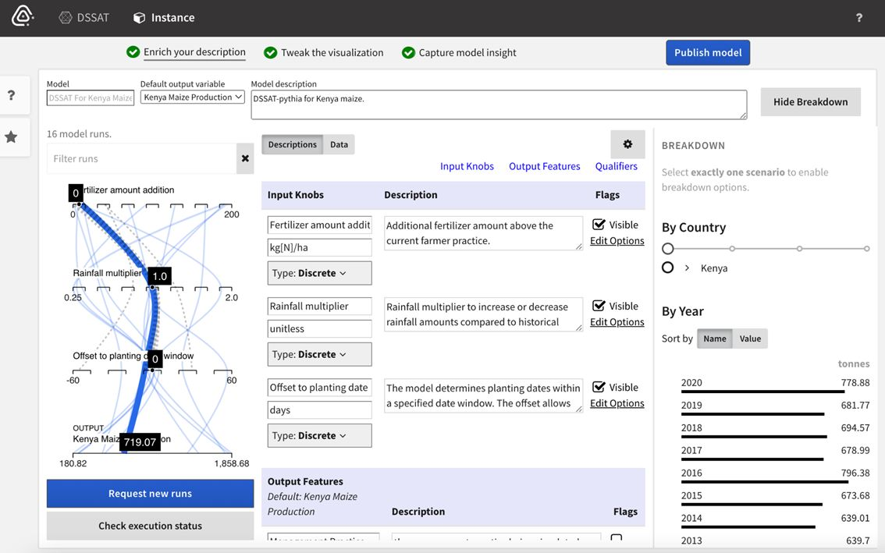
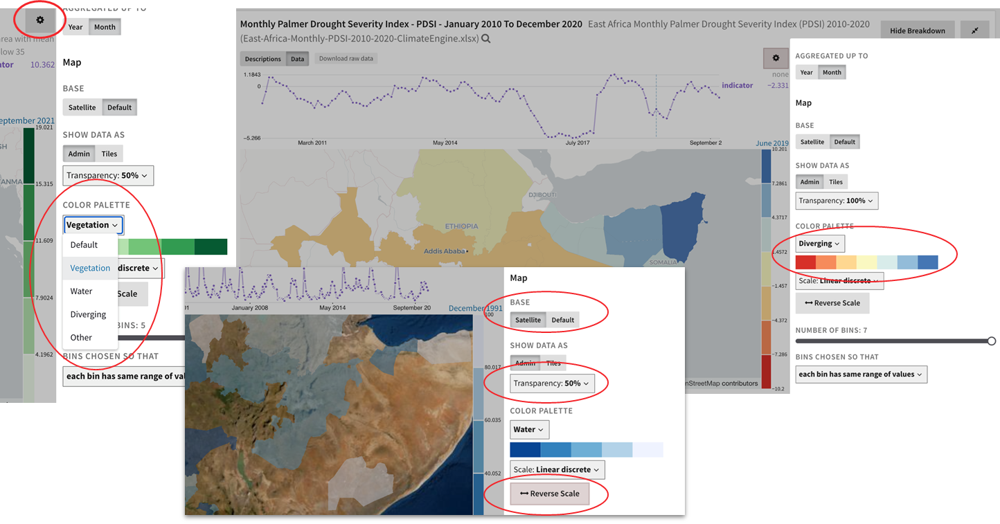

# Publishing Models

In Causemos, each model family has one space where analysts can enrich
its metadata, configure visualization options, and capture the default
insight.

To enrich a model, you can edit any of its metadata, such as
descriptions, provenance information, and configurations (default
aggregation functions, resolution, etc). You need to save at least one
insight that reflects the default model use case prior to publishing the
model.

Model input parameters can be configured according to their type:

-   **Discrete** (string, nominal, ordinal)
-   **Continuous** (number, int, float)
-   **Freeform** (bbox, geo-code, geo name)

The **aggregation** function needs to be selected in order to see the
data on the map.

**Color Scales** can be adjusted to determine how the model data appears
on the map.

