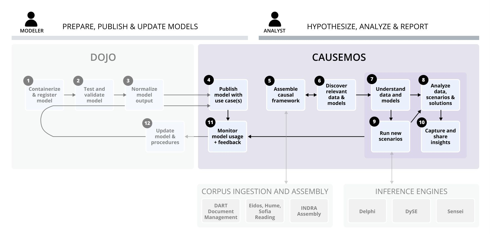
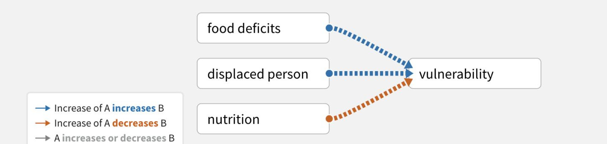
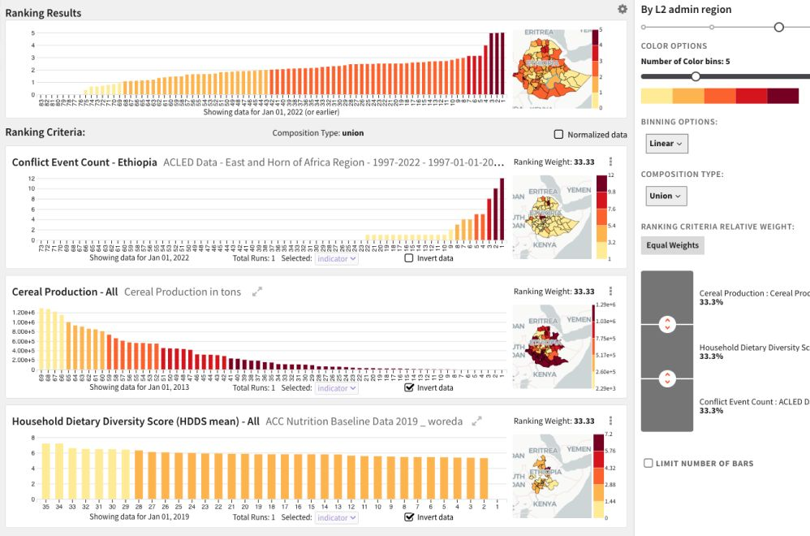
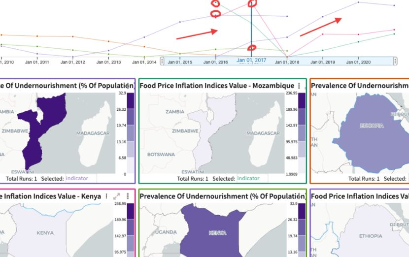
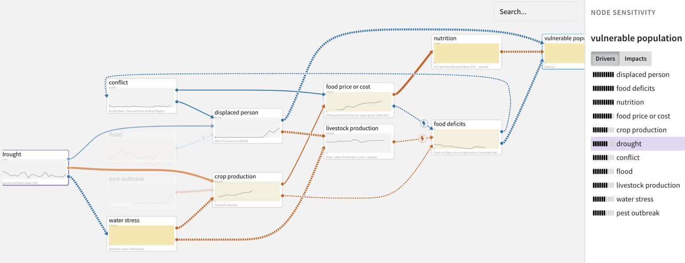
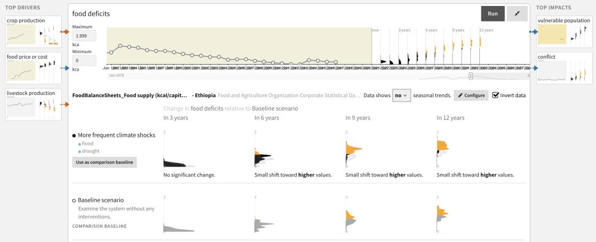
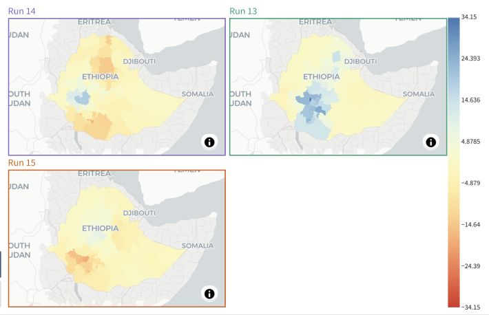
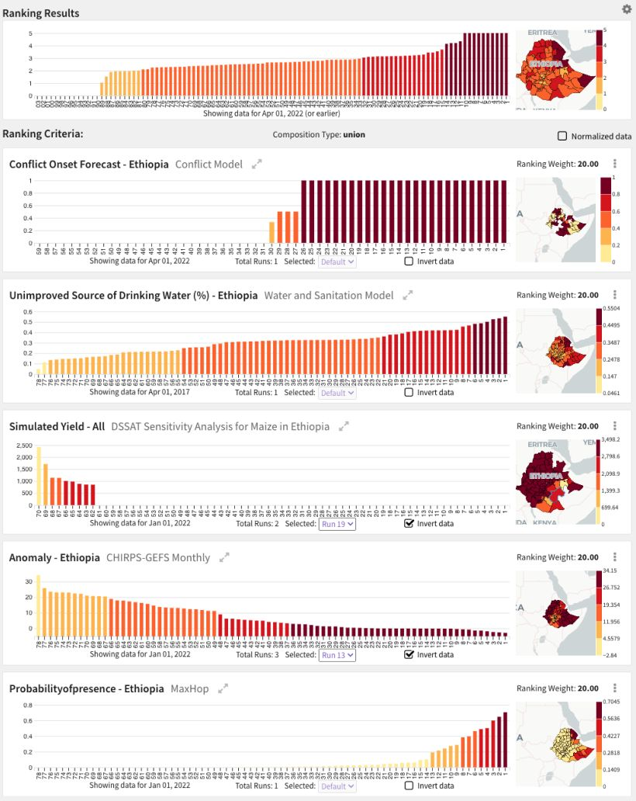
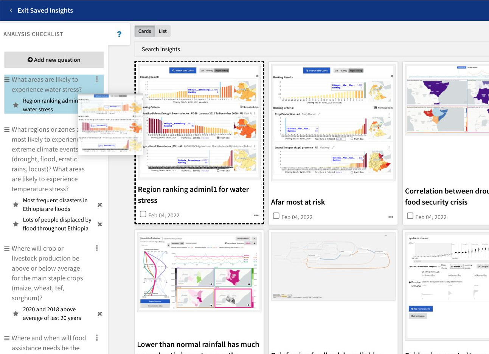

# Causemos Human Machine Interface (HMI)

The analytic workflow example in the following sections illustrates the
use of the different views and tools in the Causemos HMI. The goal of
the analysis in this case is to estimate the population vulnerable to
food insecurity.

**Note**: Analytic workflows are highly non-linear. Causemos supports
many different workflow paths.

## Capturing Target Variables and Key Drivers in Simple CAGs

Causal analysis graphs (CAGs) help analysts define what they're trying
to understand or influence and determine how it can be measured. In
building a simple CAG, analysts can capture the target variables and key
drivers.

### Food Insecurity Example

To begin estimating the population vulnerable to food insecurity,
capture the key factors that lead to vulnerability, which include *food
deficits*, *poor nutrition*, and *displacement*.

## Combining Datacubes of Key Drivers to Rank Regions for the Target Variable

Datacubes are sets of data derived from expert model simulations or
other structured datasets. They help analysts drill down on the factors
in a CAG to understand where the issue is currently most prevalent based
on the combination of its key drivers.

### Food Insecurity Example

Combine the datacubes of the key drivers to get a region ranking for the
number of vulnerable people based on weighted criteria that correspond
to the factors in the CAG. Identify the weighted criteria by using the
data explorer to find appropriate data proxies or by bringing outside
data into the system.

## Analyzing Driver Datacubes

Further analysis of datacubes for the key drivers can help identify
historical and regional analogs or current and potential future levels.

### Food Insecurity Example

Looking at malnourishment over time, identify historical periods when it
was particularly high. Since food availability did not follow the same
pattern, hypothesize that food affordability may have restricted food
diversity and caused malnourishment. By exploring available datacubes
for food prices, see that spikes in food prices are usually correlated
with spikes in malnourishment. Looking at neighboring countries with
high food inflation also shows correlation with peaks in malnourishment.

## Leveraging Integrated Knowledge to Augment CAGs

By leveraging integrated knowledge, analysts can augment a simple CAG to
create more explanatory power. This can help identify the key dynamics
of the system, explaining the root causes and impacts of the issue.

### Food Insecurity Example

Add conflict as a driver of displacement and capture a reinforcing
feedback loop between food deficits and conflict. Add crop production as
a driver of food deficits and the interaction with climate shocks, food
prices, and conflict. Apply sensitivity analysis to see that change in
climate drivers has the most impact on the whole system. Explore the
ranked pathways between each climate driver and vulnerability to better
understand risk.

## Comparing Baseline Risk Assessment with What-If Scenarios

Using the CAG and domain models to compare baseline risk assessment with
various "what-if" scenarios can help identify whether and why things
will worsen, improve, or remain the same.

### Food Insecurity Example

The direction of the baseline projections in the CAG suggest that
conflict will keep pushing food prices higher, which will reduce food
affordability. Despite stable food availability (assuming an average
harvest), food deficits will worsen, which will fuel more conflict.
Harmful climate scenarios (drought, flood) push crop production down and
displacement up, which amplifies the baseline trends.

To understand which regions might be most affected by various scenarios
in more detail, compare the impacts of different rainfall scenarios
relative to the normal conditions in the DSSAT domain model available in
Causemos. See that increasing fertilizer usage has diminishing returns
but could mitigate the impacts of drought in some regions. Use the
CHIRPS-GEFS model to get a climate forecast for the next three months
and assess the likelihood of the explored climate scenarios.

## Combining Datacubes to Rank Project Impacts

Combine the datacubes used for forecasts, scenarios, and interventions
to get region rankings of project impacts and understand where resources
should be directed to target the issue.

### Food Insecurity Example

Rank regions based on the size of vulnerable populations for projected
climate risks in datacubes of domain models (e.g. for crop production,
pest likelihood and market access). Compare the ranking with the
addition of simulated interventions in those models.

## Insights

Causemos enables analysts to track and organize analytical processes as
insights, which are saved use cases or checkpoints that can be restored.
Insights can include meaningful analytical findings (big or small),
bugs/issues to share with developers, or descriptions of what needs to
be improved or done next.

## Installation

Detailed Causemos installation can be found in
[https://github.com/uncharted-causemos/quickstart](https://github.com/uncharted-causemos/quickstart)

The following describes steps to install and run the Causemos
application stack. This assumes the infrastructures and initial setups
are in place. To install and configure the infrastructure, see the section 
below.

1.  Clone `git@github.com:uncharted-causemos/quickstart.git`
2.  Go into services directory
3.  Change the configuration files under envs
4.  Run docker-compose up
5.  Causemos will be available on localhost:3003

To install the Causemos Infrastructure stack, and prep the initial data:

1.  Prepare environment: [https://github.com/uncharted-causemos/quickstart#prerequisite](https://github.com/uncharted-causemos/quickstart#prerequisite)
2.  Clone `git@github.com:uncharted-causemos/quickstart.git`
3.  Go to infra directory
4.  Run docker-compose up
5.  Install mappings: [https://github.com/uncharted-causemos/quickstart#elasticsearch](https://github.com/uncharted-causemos/quickstart#elasticsearch)
6.  Install geo data: [https://github.com/uncharted-causemos/quickstart#configure-geo-reference-dataset](https://github.com/uncharted-causemos/quickstart#configure-geo-reference-dataset)
7.  Install default buckets: [https://github.com/uncharted-causemos/quickstart#minio-setup](https://github.com/uncharted-causemos/quickstart#minio-setup)
8.  Set up default prefect project: [https://github.com/uncharted-causemos/quickstart#prefect-setup](https://github.com/uncharted-causemos/quickstart#prefect-setup)