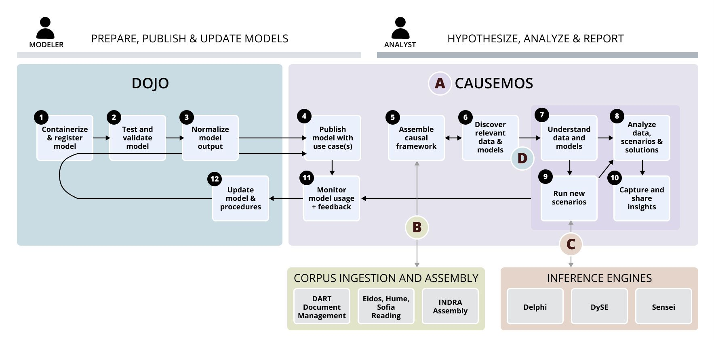
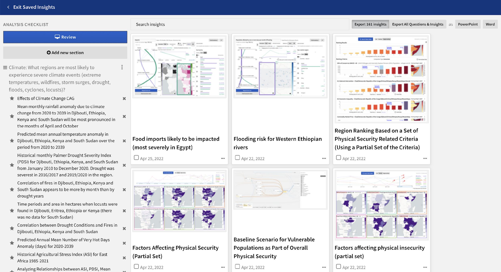
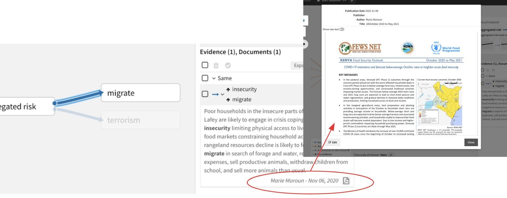
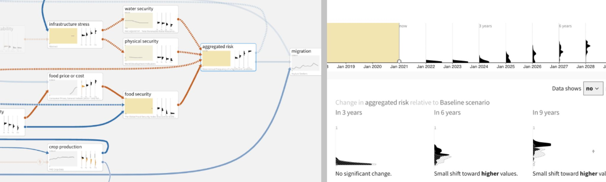
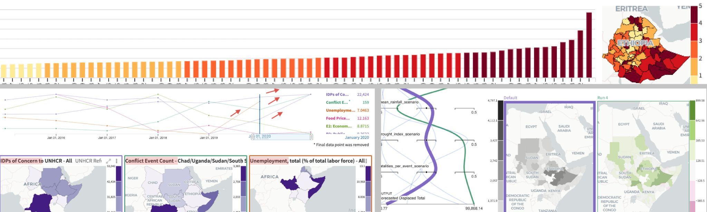

# World Modelers

The World Modelers program aims to develop technology that integrates
qualitative causal analyses with quantitative models and relevant data
to provide a comprehensive understanding of complicated, dynamic
national security questions. The goal is to develop approaches that can
accommodate and integrate dozens of contributing models connected by
thousands of pathways---orders of magnitude beyond what is possible
today.

World Modelers analyses are intended to be timely enough to recommend
specific actions that could avert crises. The program seeks to develop
technologies that will provide clearly parameterized, quantitative
projections within weeks or even hours of processing, compared to the
months or years it takes today to understand considerably simpler
systems.

World Modelers technologies will be applied to increasingly varied use
cases as they mature through the phases of the program. Questions for
analysis will typically be framed at subnational scales and look one to
five years into the future, although the factors that influence outcomes
of interest might operate on larger spatial and temporal scales. This
subnational focus reflects the changing nature of conflict and security,
which, increasingly, plays out in cities and districts. The first use
case of World Modelers is food insecurity resulting from the
interactions of multiple factors, including climate, water availability,
soil viability, market instability, and physical security.

## Causemos

Causemos is a collaborative analytical platform, developed by
Uncharted Software, that serves as the main human-machine interface
(HMI) for the World Modelers program. Its qualitative and quantitative
analysis workflows are designed to allow analysts---from generalists
to subject matter experts---to leverage integrated knowledge, data,
and models to better understand complex multi-domain issues.

-   **Create custom models:** Build causal analysis graphs to represent
    your mental model of the complex system you are analyzing. Augment
    the model with system-generated suggestions based on evidence from
    uploaded scientific literature. Use the model to visualize the
    cascading effects of change from different scenarios.
-   **Analyze data across time and space:** Quantify your mental model
    with system suggestions or upload your data. **Use comparative
    analysis capabilities** to understand the historical precedents,
    regional analogs and correlations between variables.
-   **Identify risk:** Create your own composite index of risk based on
    the weighted key drivers identified in your causal analysis graph.
    Easily **explain why** a region\'s population is considered most
    at risk.
-   **Plan interventions:** With more visible levers in the causal
    analysis graphs, **think creatively about interventions**, their
    challenges, and the unanticipated second and third order impacts.
    Complement with integrated sector-specific expert models to **test
    scenarios and interventions** at higher spatial resolution.
-   **Build briefings:** Capture insights throughout the analysis
    process and export findings to support report generation and
    briefings.

## Corpus Ingestion and Assembly

DART, developed by TwoSix Labs, is the technology pipeline for
uploading and extracting text and analytics from documents. It also
provides capabilities to enable rapid ontology curation. Three machine
readers (Eidos from University of Arizona, Hume from BBN and Sofia
from Carnegie Mellon university) extract causal statements from the
corpus of documents. INDRA, developed by Harvard Medical School,
assembles the causal statements into knowledge bases that can be
leveraged by analysts in Causemos to build qualitative models backed
by evidence from the literature.

## Qualitative Analysis

The qualitative ("top-down") analysis space in Causemos enables causal
analysis graph (CAG) assembly and scenario analysis using three
inference engines: DySE from University of Pittsburgh, Delphi from
University of Arizona, and Sensei from Jataware. Qualitative models
define representation and reasoning about continuous aspects of
entities and systems in a symbolic, human-like manner (Forbus 2008).
They allow analysts to:

-   Facilitate collaboration by making their knowledge of a complex
    problem explicit.
-   Make sense of and communicate complexity as stories.
-   Get a holistic picture not constrained by availability of
    quantitative data.
-   Develop effective interventions and see unintended consequences.

Supported qualitative analysis types in Causemos include:

-   Identifying from literature the main drivers and relationship
    evidence for target concepts of interest
-   Capturing core feedback loops causing a problem
-   Identifying most influential drivers/impacts
-   Identifying most influential pathways
-   Performing current situation / baseline trends assessment
-   Comparing scenarios

## Quantitative Analysis

The quantitative ("bottom-up") analysis space in Causemos enables
comparative analysis across and within datacubes and quantitative
models. Quantitative models incorporate higher-resolution data and
mathematical representations to describe the performance of a system
for different inputs and initial states. This valuable source of
knowledge is typically inaccessible to analysts, as they usually lack
the means for finding, calibrating and running these expert models.
Dojo, developed by Jataware, enables quantitative model data
preparation and registration, which makes these valuable assets
accessible to analysts in Causemos.

Quantification makes qualitative models less subjective; Causemos uses
the data to make inferences about the nature of the relationships. The
system provides a head start on quantification by automatically
matching datacubes to concepts. However, human judgment is needed to
validate the defaults and resolve any data quality issues.

Supported qualitative analysis types in Causemos include:

-   Regional analog (spatial)
-   Historical analog (temporal)
-   Categorical breakdown
-   Scenarios comparison
-   Region ranking
-   Correlation of variables
-   Similar models/data comparison

