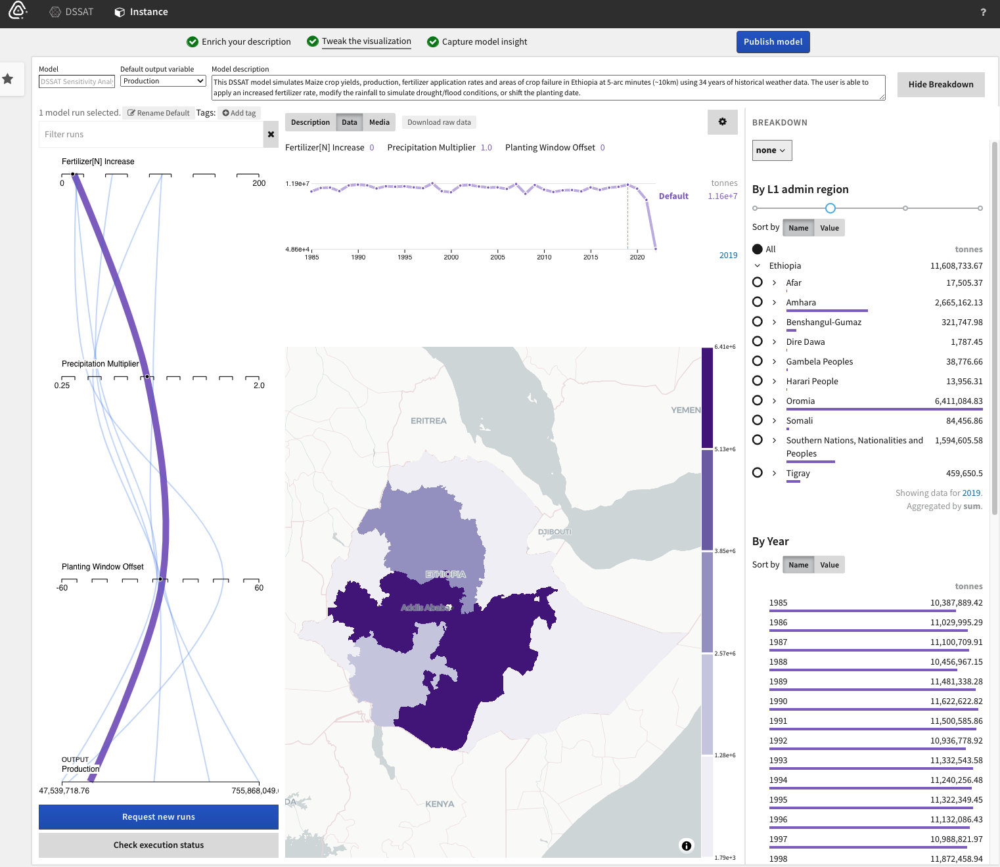

# World Modelers

The World Modelers program aims to develop technology that integrates qualitative causal analyses with quantitative models and relevant data to provide a comprehensive understanding of complicated, dynamic national security questions. The goal is to develop approaches that can accommodate and integrate dozens of contributing models connected by thousands of pathways—orders of magnitude beyond what is possible today.

World Modelers analyses are intended to be timely enough to recommend specific actions that could avert crises. The program seeks to develop technologies that will provide clearly parameterized, quantitative projections within weeks or even hours of processing, compared to the months or years it takes today to understand considerably simpler systems.

World Modelers technologies will be applied to increasingly varied use cases as they mature through the phases of the program. Questions for analysis will typically be framed at subnational scales and look one to five years into the future, although the factors that influence outcomes of interest might operate on larger spatial and temporal scales. This subnational focus reflects the changing nature of conflict and security, which, increasingly, plays out in cities and districts. The first use case of World Modelers is food insecurity resulting from the interactions of multiple factors, including climate, water availability, soil viability, market instability, and physical security.

 