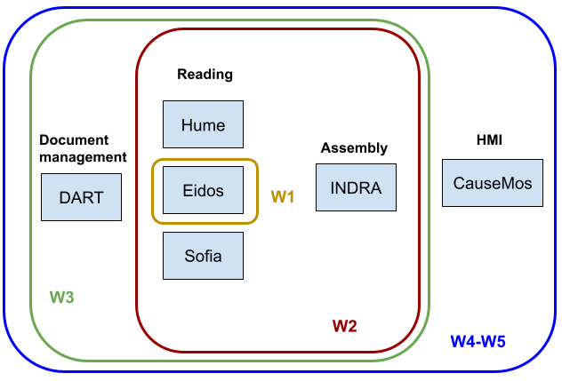

# Overview
## World Modelers document management / reading / assembly / HMI workflows

Here we describe how to set up and run the systems responsible for
document corpus ingestion, machine reading, knowledge assembly, and human-machine
interface (HMI)-based exploration.

First, we describe running the full integrated system as a set of
interconnected Docker containers. Once running, this integrated system
allows for uploading documents through a web-based UI, having machine-reading
systems process these documents, and then creating an assembled knowledge
base that can be loaded into the Causemos HMI. From the assembled knowledge
base, individual projects can be initiated and maintained. Uploading new
documents for a given project is also supported, with new causal knowledge
extracted from the documents incrementally added to the project.

In addition to the integrated system, we also document and provide
tutorials for running component technologies in simpler, more limited
workflows: "Reading only" and "Reading and assembly".
These workflows can be useful for prototyping changes
to component technologies before moving onto full integration, or for
situations where only a subset of component systems are needed.

  

## Step-by-step tutorials

This section contains tutorials that each describe one specific
workflow on a set of publicly available sample documents. Users can follow
these tutorials step by step as a starting point and adapt them to
their own use cases.

- [Integrated workflow tutorial](reading-assembly/integrated_tutorial.md)

  In this tutorial, we provide a step-by-step example of running the integrated
  system as a set of Docker containers, uploading a handful of documents
  for processing, and then examining the resulting causal knowledge
  base extracted and assembled from these documents.

- [Reading only tutorial](reading-assembly/reading_tutorial.html)

  In this tutorial, we provide a step-by-step example of running the
  Hume reader on a set of documents to produce output in JSON-LD format
  that can be used for downstream analysis.

- [Reading and assembly tutorial](reading-assembly/reading_assembly_tutorial.html)

  In this tutorial, we provide a step-by-step example of running
  a machine reading system on a set of sample documents and then running
  INDRA assembly on the outputs of the system.

## Running the integrated system

In this integrated workflow, system components are running as a set of
network-linked Dockerized containers. The DART system is used for managing
documents and using a standardized interface between DART and the reading
systems. This avoids having to manually prepare input files for reading. DART
also makes available a UI for interactive ontology management and extension.
Reader output is integrated and assembled (through a set of normalization,
processing and filtering steps) by INDRA World. Finally, the assembled knowledge
base from INDRA World can be loaded into Causemos for exploration. Causemos also
allows uploading new documents and incrementally adding them to the causal
knowledgebase during runtime.

Systems used:
* Document and ontology management: [DART](reading-assembly/dart.html#w5)
* Readers: [Eidos](reading-assembly/eidos.html#w5), [HUME](reading-assembly/hume.html#w5), [Sofia](reading-assembly/sofia.html#w5)
* Integration/assembly: [INDRA](reading-assembly/indra.html#w5)
* HMI: [Causemos](reading-assembly/causemos.html#w5)

## Sub-system workflows

### Reading only

Machine-reading systems can be run independent of the integrated 
World Modelers system. In this case, users are responsible for preparing
input documents in an appropriate form and processing reading system
outputs for downstream usage.

The following pages provide detailed instructions for running each reading
system in a reading-only workflow:

  * [Eidos](reading-assembly/eidos.html#w1)
  * [HUME](reading-assembly/hume.html#w1)
  * [Sofia](reading-assembly/sofia.html#w1)

### Reading + integration/assembly

Running multiple reading systems on the same set of documents can provide
increased coverage and - through exploiting redundancy - a more reliable
knowledge base. INDRA World provides a programmatic interface for
working with reader outputs, combining extractions in a standardized
form, and running a variety of configurable processing and filtering
components to create a coherent knowledge base. This section describes
the usage of these components independent of the integrated system.

Systems used:
  * Readers: one or more of [Eidos](reading-assembly/eidos.html#w2), [HUME](reading-assembly/hume.html#w2), or [Sofia](reading-assembly/sofia.html#w2)
  * Integration/assembly: [INDRA](reading-assembly/indra.html#w2)

## Component-specific documentation

* Readers
  * [Eidos](reading-assembly/eidos.html)

    Eidos is the machine reading system developed by the CLU lab at University of Arizona.
  
    Workflows: ([Reading only](reading-assembly/eidos.html#w1), [Reading and assembly](reading-assembly/eidos.html#w2), [Integrated](reading-assembly/eidos.html#w5))

  * [HUME](reading-assembly/hume.html)
  
    Hume is BBN's machine reading system that extracts causal relations from text and supports clustering for ontology construction.
    
    Workflows: ([Reading only](reading-assembly/hume.html#w1), [Reading and assembly](reading-assembly/hume.html#w2), [Integrated](reading-assembly/hume.html#w5))

  * [Sofia](reading-assembly/sofia.html)

    Sofia is a machine reading system developed at CMU that extracts causal relations from text.
  
    Workflows: ([Reading only](reading-assembly/sofia.html#w1), [Reading and assembly](reading-assembly/sofia.html#w2), [Integrated](reading-assembly/sofia.html#w5))

* Integration/assembly
  * [Indra World](reading-assembly/indra.html)
  
    INDRA World is a knowledge assembly system that integrates causal relations extracted by multiple reading systems,
    standardizes their representation, finds ontological relationships between relations, calculates overall confidence,
    and has a configurable pipeline to process and filter causal knowledge.
  
    Workflows: ([Reading and assembly](reading-assembly/indra.html#w2), [Integrated](reading-assembly/indra.html#w5))

* Document management
  * [DART](reading-assembly/dart.html)
  
    The Data Analytics and Reasoning Toolkit (DART) is the data ingestion pipeline for the World Modelers platform.
    
    Workflows: ([Integrated](reading-assembly/dart.html#w5))

* HMI (Human-Machine Interface)
  * [Causemos](reading-assembly/causemos.html)
  
    Causemos is the main HMI for the World Modelers program, built and maintained by Uncharted Software.
  
    Workflows: ([Integrated](reading-assembly/causemos.html#w5))
