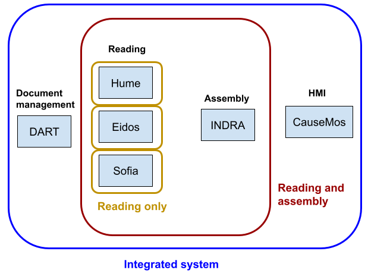

# Overview
## World Modelers document management / reading / assembly / HMI workflows

This document describes usage modes that are explicitly supported and documented as workflow templates (W1-5 below). While these templates don’t cover every conceivable combination and usage mode, they are likely to be relevant for typical use cases. Customizations to the ontology and the usage of associated tools cuts across all of these workflows, and can in principle be relevant for any of them, therefore, these are documented separately.

  

## Documentation by Workflow

### W1. Reading only
In this usage mode the goal is to perform information extraction from a set of input documents that are manually compiled and brought into a form that one of the reading systems takes as input (e.g., a folder with txt files). This usage mode doesn't involve document management through DART or multi-reader integration/assembly through INDRA, but rather, meaning that users are responsible for their own downstream processing of reader outputs and derived analysis.

Systems used:
  * Readers: any of ([Eidos](eidos.html#w1), [HUME](hume.html#w1), or [Sofia](sofia.html#w1))

### W2. Reading + integration/assembly
In this usage mode, the goal is to perform information extraction on a set of input documents and then use INDRA to benefit from some combination of (i) multi-reader integration
(ii) knowledge assembly functionalities
(iii) standardized representation of reader outputs
(iv) standard programmatic APIs for interfacing with readers and their outputs.
The user in this mode is again responsible for document gathering and preparing inputs for reading but may use INDRA as a wrapper around calling one or more reading systems. The user is expected to then either use assembled INDRA Statements as objects or in a JSON-serialized form for their own downstream analysis.

Systems used:
  * Readers: one or more of ([Eidos](eidos.html#w2), [HUME](hume.html#w2), or [Sofia](sofia.html#w2))
  * Integration/assembly: ([INDRA](indra.html#w2))

### W3. Document management + reading + integration/assembly
In this usage mode, the DART system is used for managing documents and using a standardized interface between DART and the reading systems. This avoids having to manually prepare input files for reading. The rest of the workflow follows W2 in that INDRA is used for integration. The user then takes INDRA Statements for further downstream analysis.

Systems used:
  * Document management: ([DART](dart.html#w3))
  * Readers: ([Eidos](eidos.html#w3), [HUME](hume.html#w3), [Sofia](sofia.html#w3))
  * Integration/assembly: ([INDRA](indra.html#w3))

### W4. Document management + reading + integration/assembly + HMI
This usage mode goes beyond W2 or W3 by loading INDRA outputs into Causemos to explore, curate, and derive models from the assembled causal information. However, in this setting, the user is not expecting a service architecture to support incremental reading/assembly during runtime. The usage of DART is technically not required for W4 but it allows linking back to documents and examining their metadata which is advantageous. This workflow can be understood as a one-time run of W2/W3 and then loading results into the HMI as a “static” corpus.

Systems used:
  * Document management: ([DART](dart.html#w4))
  * Readers: ([Eidos](eidos.html#w4), [HUME](hume.html#w4), [Sofia](sofia.html#w4))
  * Integration/assembly: ([INDRA](indra.html#w4))
  * HMI: ([Causemos](causemos.html#w4))

### W5. Document management + reading + integration/assembly + HMI + BYOD
This workflow builds on W4 and also enables users to add their own documents during runtime through Causemos. This requires DART, one or more readers, and INDRA World to be running as services.

Systems used:
  * Document management: ([DART](dar.html#w5))
  * Readers: ([Eidos](eidos.html#w5), [HUME](hume.html#w5), [Sofia](sofia.html#w5))
  * Integration/assembly: ([INDRA](indra.html#w5))
  * HMI: ([CauseMos](causemos.html#w5))

## Documentation by Component

* Readers
  * [Eidos](eidos.html)

    Eidos is the machine reading system developed by the CLU lab at University of Arizona.
  
    Workflows: ([W1](eidos.html#w1), [W2](eidos.html#w2), [W3](eidos.html#w3), [W4](eidos.html#w4), [W5](eidos.html#w5))

  * [HUME](hume.html)
  
    Hume is BBN's machine reading system that extracts causal relations from text and supports clustering for ontology construction.
    
    Workflows: ([W1](hume.html#w1), [W2](hume.html#w2), [W3](hume.html#w3), [W4](hume.html#w4), [W5](hume.html#w5))

  * [Sofia](sofia.html)

    Sofia is a machine reading system developed at CMU that extracts causal relations from text.
  
    Workflows: ([W1](sofia.html#w1), [W2](sofia.html#w2), [W3](sofia.html#w3), [W4](sofia.html#w4), [W5](sofia.html#w5))

* Integration/assembly
  * [Indra World](indra.html)
  
    INDRA World is a knowledge assembly system that integrates causal relations extracted by multiple reading systems,
    standardizes their representation, finds ontological relationships between relations, calculates overall confidence,
    and has a configurable pipeline to process and filter causal knowledge.
  
    Workflows: ([W2](indra.html#w2), [W3](indra.html#w3), [W4](indra.html#w4), [W5](indra.html#w5))

* Document management
  * [DART](dart.html)
  
    The Data Analytics and Reasoning Toolkit (DART) is the data ingestion pipeline for the World Modelers platform.
    
    Workflows: ([W3](dart.html#w3), [W4](dart.html#w4), [W5](dart.html#w5))

* HMI (Human-Machine Interface)
  * [CauseMos](causemos.html)
  
    Causemos is the main HMI for the World Modelers program, built and maintained by Uncharted Software.
  
    Workflows: ([W4](causemos.html#w4), [W5](causemos.html#w5))
