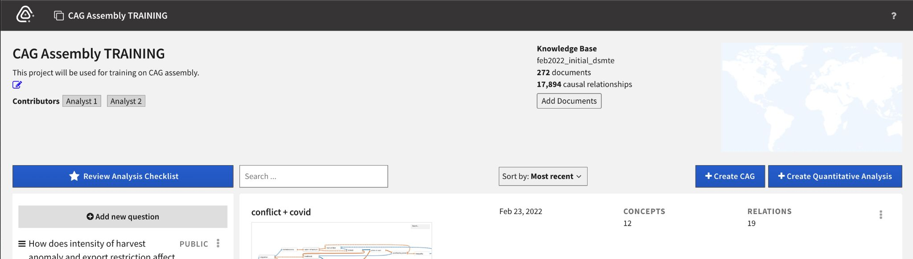
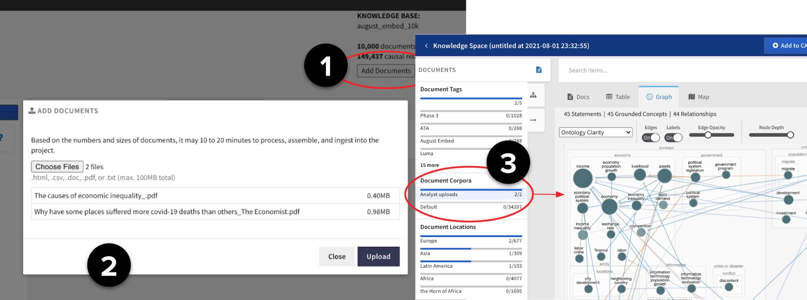

# Causemos HMI

In Causemos, individual analysts or analytical teams work in an
**Analysis Project**. When creating a new Analysis Project, you select
the **Knowledge Base** containing the literature relevant to the
analysis domain(s).

Some metadata about the Knowledge Base is visible on the Project page:
name, number of documents, and number of causal relationships extracted
from these documents.



Analysts can upload additional documents to the project knowledge base
and use the extracted relations.




# Workflows

<a id="w4"></a>
## [W4](index.html#w4) Document management + reading + integration/assembly + HMI
In this workflow, Causemos ingests, combines and enriches an INDRA statements dataset and a DART CDR dataset to create a new Knowledge Base dataset.

Here is an abridged and lightweight version of using Causemos as a knowledge explorer, for more detail on a complete Causemos install please consult the [full documentation](https://github.com/uncharted-causemos/quickstart#loading-knowledge-data).

```
# 1. Clone quick start
git clone git@github.com:uncharted-causemos/quickstart.git

cd app-kb

# 2. Update configuration files under env

# 3. Start docker, this may take > 30 seconds
docker-compose up
```
Causemos should be available on http://localhost:3003


To load data into Causemos we need 
- INDRA dataset
- DART CDR dataset, in JSON-L format

To create a CDR dataset, you can use the following script that will pull and convert to JSON-L. You will need to supply the access credentals.

```
#!/usr/bin/env bash

# TwoSix CDR download
# 1 - download zip to tmp
# 2 - extract and rebulid json-l
# 3 - clean up

# Clean up
rm raw_data.zip
rm -rf tmp

mkdir tmp

# Download
DART="https://wm-ingest-pipeline-rest-1.prod.dart.worldmodelers.com/dart/api/v1"
USERNAME="XXXXXXX"
PASS="XXXXXXX"
AUTH=`echo -n $USERNAME:$PASS | base64`

curl -XGET \
  -H "Accept: application/zip"  \
  -H "Authorization: Basic $AUTH" \
  "$DART/cdrs/archive" -o raw_data.zip

# Extract
unzip -j raw_data.zip -d tmp

rm dart_cdr.json
for f in tmp/*.json; do
  cat $f >> dart_cdr.json
  echo >> dart_cdr.json
done
```

To kick off the data ingestion, use the curl command, replace the `indra` and `dart` with the appropriate paths, note they can be URLs or file paths (file://).

```
#!/usr/bin/env bash

curl -XPOST -H "Content-type: application/json" http://localhost:6000/kb -d'
{
  "indra": "http://10.64.16.209:4005/pipeline-test/indra",
  "dart": "http://10.64.16.209:4005/pipeline-test/dart/july-sample.jsonl"
}
'
```


<a id="w5"></a>
### [W5](index.html#w5) Document management + reading + integration/assembly + HMI + BYOD
In this workflow, it is assumed that both INDRA and DART are running as web services and have been configured in the env files. No additional setup is needed here.
