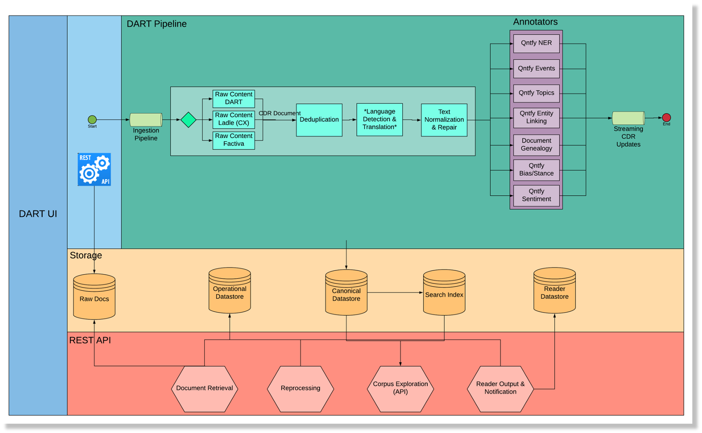
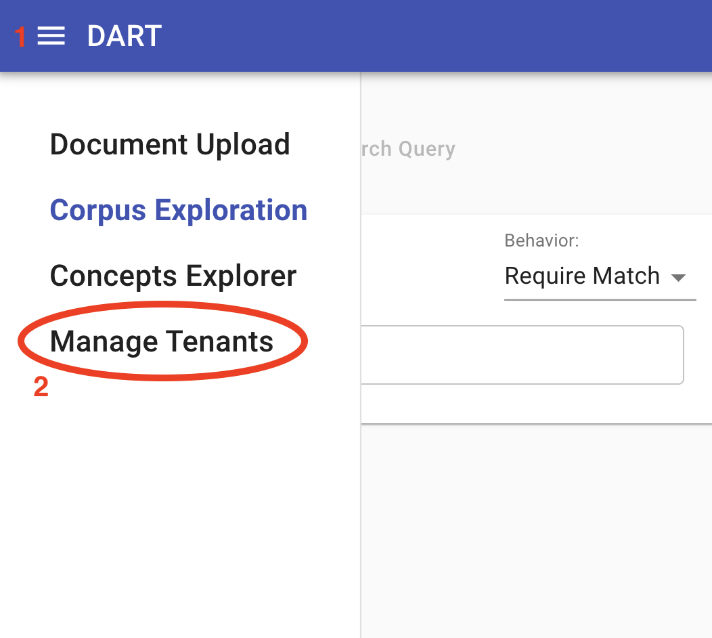
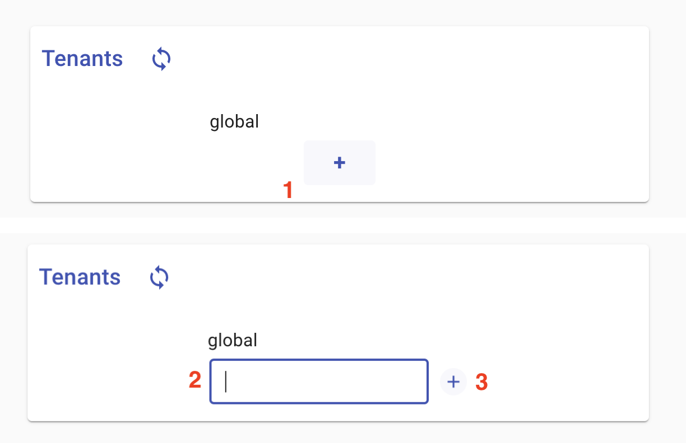
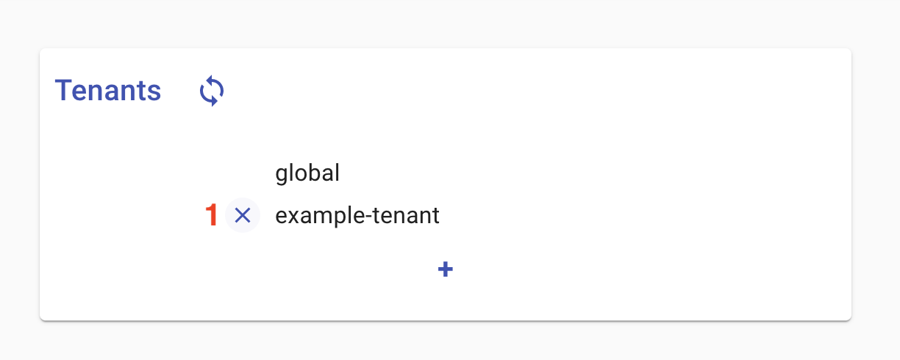
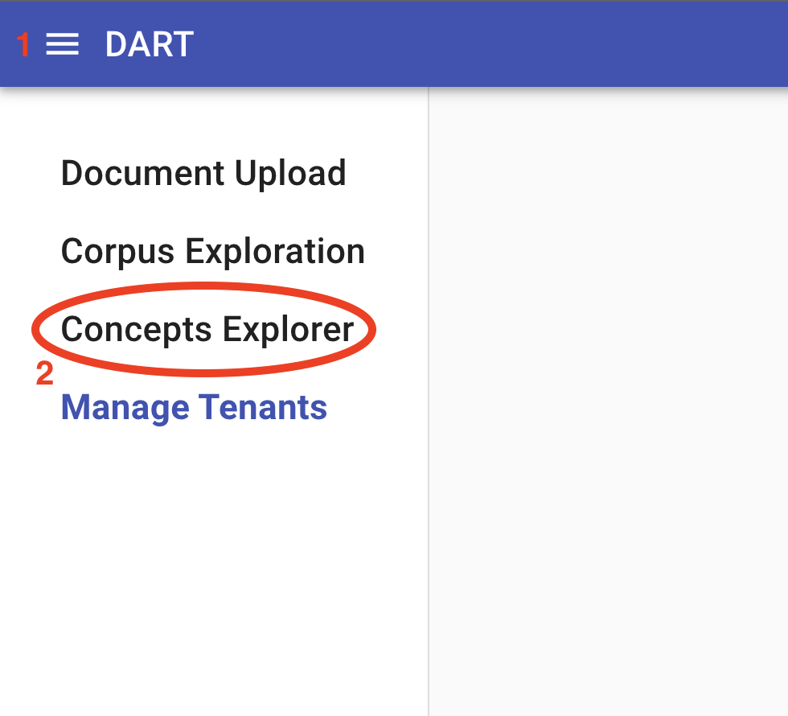
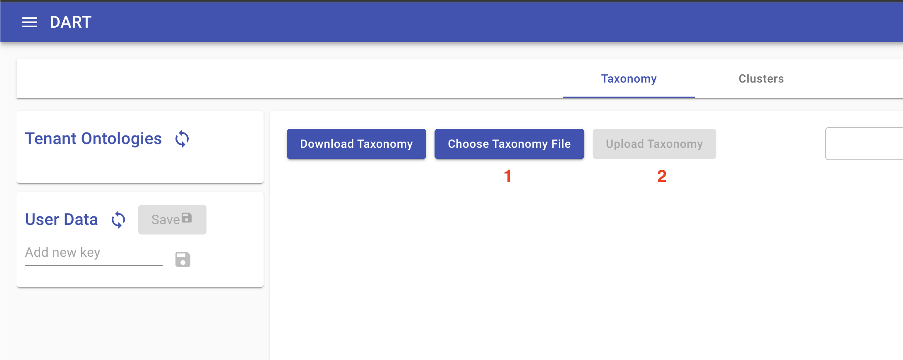
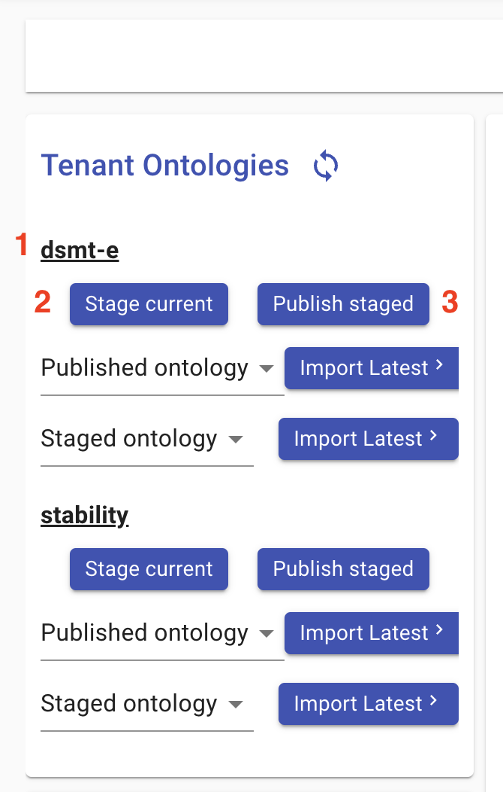
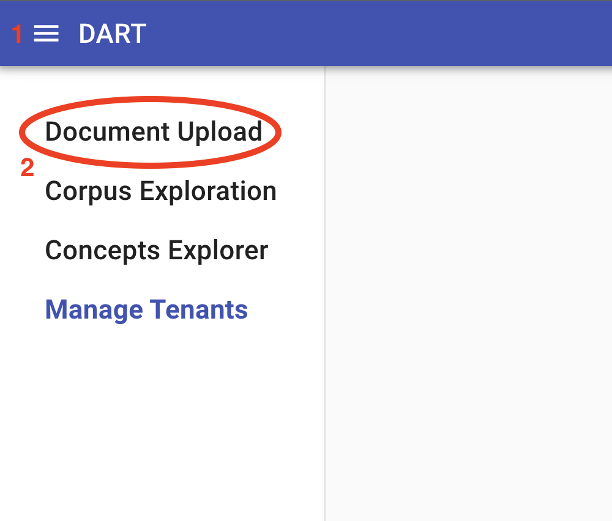
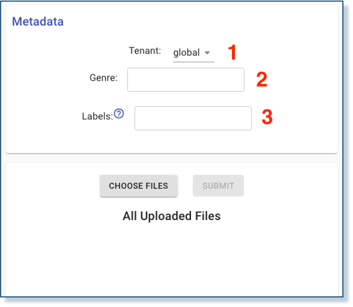
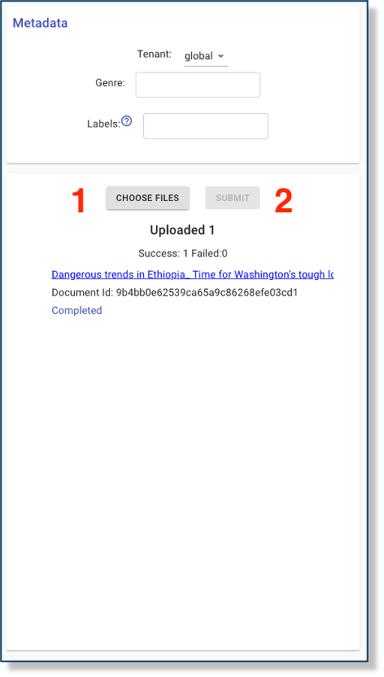

# DART

The Data Analytics and Reasoning Toolkit (DART) is the data ingestion pipeline for the World Modelers platform. 
Its primary function is to extract metadata and text from source documents, convert these data to a normalized 
data format, and pass this normalized data on to the reader technologies that can identify and extract causal 
relations for use in Causemos. It provides APIs and user interfaces for document submission, retrieval, and 
search, and it handles storage and retrieval of reader outputs. Finally, it provides APIs and user-facing tools 
for managing and developing the ontologies used by the readers to ground causal extractions. 

<p align="center">
  
</p>

The DART code repositories [can be found here](https://github.com/twosixlabs-dart).

## Running DART-In-A-Box

All of the  workflows described below require running the DART pipeline along with the available reader technologies 
and Indra, either locally or in a cloud environment. The DART team has developed a simplified deployment configuration that includes 
all of these three components together in a standalone system called "DART-In-A-Box" (DIAB). The following instructions explain 
how to deploy this configuration using the DART command line interface.

### DART-CLI

To deploy DART, you will need to use DART's command line toolkit, DART-CLI. DART-CLI is a python application designed to run on OSX and 
linux environments. It requires python 3.9, and its full functionality requires an installation of `ssh` and `docker`. If these requirements are 
satisfied in your environment, you can install DART-CLI using:

```bash
pip3 install dart-cli
```

To confirm that the installation was successful, run:

```bash
dart --version
```

If you wish to run DART-CLI in an unsupported environment, you can use the dart-cli docker image. To retrieve this image, run:

```bash
docker pull twosixlabsdart/dart-cli
```

The recommended usage of the dart-cli docker image is to open an interactive shell session and executes `dart` commands within that session. 
To do so, execute the following, replacing "HOME-DIRECTORY" with the path to your user's home directory:

```bash
docker run -it --rm -v "/var/run/docker.sock:/var/run/docker.sock:ro" -v [HOME-DIRECTORY]:/root twosixlabsdart/dart-cli:latest
```

This should bring up a command prompt (`#`). Run `dart --version` to confirm that it works. By mapping your home directory, dart-cli will be able to persist configuration data across sessions and will have access to your `ssh` keys, which will be necessary if you are using a remote deployment.

### Local Deployment

A DART deployment that includes reading and assembly will need approximately ??? cores/cpus and ??? Gb memory to function. If your local machine can support this, you can stand up a local instance of DART using the following command:

```bash
dart pipeline deploy --diab-dir [optional-data-directory]
```

The `--diab-dir` option allows you to choose where DART will persist any data. If you omit this flag it will use your current working directory. Note that if you are running within docker, the data will end up in your user home directory, as long as you have mapped that directory as described above.

To confirm that the deployment worked, navigate to `http://localhost` in a web browser (preferably chrome). It should eventually load a user interface.

### Remote Deployment

DART-CLI can automate remote deployment using `ssh`. To start a remote deployment, you will need:

1. The hostname or IP of a remote linux instance, with ssh access enabled, where you intend to deploy DART. This instance must have docker installed and running.
2. The name of an ssh key paired with your remote instance. This key must be saved in the `.ssh` folder in your home directory.
3. The username, used by ssh, to access the remote instance.

The recommended way to deploy dart remotely is to first create a configuration profile which will persist all of the required connection details:

```bash
dart --remote [hostname/IP] --ssh-key [ssh-key-name] --diab-user [ssh-user-name] --diab-dir [optional-data-directory] profiles add [profile-name]
```

This will create a profile in a `.dart` folder within your home directory with all the required parameters (note: `--diab-dir` is optional, and allows you to specify where the data will be persisted on the remote instance). Any commands relative to this remote deployment need only include `-p [profile-name]` to inject these options.

To stand up DART on your remote instance, run the following, substituting the name of your profile created by the previous command::

```bash
dart -p [profile-name] pipeline deploy
```

If you have http access to the remote instance, you can confirm that it works by navigating to `http://[hostname-or-IP]`. It should eventually load the DART user interface (DART-UI).

## Workflows

<a id="w3"></a>
### [W3](index.html#w3) Document management + reading + integration/assembly

#### Tenant Management

Prior to submitting documents, the program  manager should decide whether the intended use case demands any 
logical separation of documents or ontologies. This may be required if multiple unrelated use cases need to 
be supported in parallel or if a single use case requires considering multiple distinct knowledge bases in 
isolation with different ontologies for each knowledge base.

Logical groupings of documents and ontologies in DART are called "tenants." Every DART instance has a "global" 
tenant, which always consists of every document in the system. By default, the global tenant is the only tenant. 
To add additional tenants, you can either use DART-CLI or the web-based user interface (DART-UI)

##### 1. Command-line tenant management

To add tenants using DART-CLI, use the following:

```bash
dart -p [profile] tenants add [tenant-name]
```

To remove a tenant:

```bash
dart -p [profile] tenants rm [tenant-name]
```

To retrieve a current list of available tenants:

```bash
dart -p [profile] tenants ls
```

##### 2. Web interface tenant management

To view, add, and remove tenants using DART-UI, navigate to the `Manage Tenants` tool in DART-UI either by opening
the toolbar menu and clicking "Document Upload" or by navigating to `[base-url]/tenants` where "base-url" is the url specified 
in `Running Dart` (above) to confirm that the deployment was successful:

<p align="center">
  
</p>

This should bring a simple page with a list of tenants. This should list only "global." To add tenant, click the `+` button 
at the bottom of the list, type in the new tenant name in the text field that appears, and hit "Enter" or click the ??? button 
to the right of the field. You should see the new appear in the list.

<p align="center">
  
</p>

To remove a tenant, hover your mouse over the undesired tenant. A small `x` button should appear to the left of it. Clicking 
this button will remove the tenant.

<p align="center">
  
</p>

#### Ontology Management

Once any tenants have been defined in DART, it is necessary to provide them with ontologies so that submitted 
documents can be read and assembled. To manage DART's ontologies, the user can navigate to the `Concepts Explorer` 
tool in DART-UI. This tool can be accessed by opening the toolbar menu and clicking "Concepts Explorer" or by 
navigating to `[base-url]/concepts`:

<p align="center">
  
</p>

`Concepts Explorer` provides an ontology editor, which will initially be blank, and a panel allowing the user to 
access ontologies from each tenant as well as ontologies saved as user data for editing before publishing to a 
tenant. In the absence of any existing ontology, the user can either build one from scratch in the UI or upload 
an existing ontology in `yaml` format. (See [World Modelers Ontologies](https://github.com/worldmodelers/Ontologies).) 
To upload an ontology, click `Choose Ontology File,` and then `Upload Ontology` once you have selected the local 
ontology file:

<p align="center">
  
</p>

Once an acceptable ontology is loaded in the editor, the user can publish it to a tenant by doing the following:

1. Find the desired tenant in the top-left panel labeled "Tenant Ontologies"
2. Click "Stage current"
3. Click "Publish staged"

<p align="center">
  
</p>

#### Document Submission

Once an ontology has been published to a tenant, documents uploaded to that tenant will automatically propagate 
to the readers and will be assembled. For purposes of demonstration, you can find a sample collection of World 
Modelers documents to use [here](https://github.com/twosixlabs-dart/world-modelers-demo-docs). Be sure to use the 
documents in the `raws` directory and not `cdrs`.

Documents can be uploaded in two ways:

##### 1. Command line submission

To upload one or more documents via DART-CLI, use the forklift command:

```bash
dart -p [profile] --tenant [tenant-name] forklift submit [file 1] [file 2] ...
```

To upload an entire directory of files:

```bash
dart -p [profile] --tenant [tenant-name] forklift submit --input-dir [directory]
```

Various kinds of metadata can be submitted along with the file, which will be incorporated into the document 
metadata within DART and propagated with document to the rest of the World Modelers system. This metadata 
can be specified via command-line options:

```bash
dart -p [profile] forklift submit \
    --tenant [tenant-name]
    --genre news-article \
    --label some-label \
    --label another-label \
    --input-dir [directory]
```

##### 2. Web interface submission

To upload a component via DART-UI, navigate to the `Document Upload` tool in DART-UI either by opening 
the toolbar menu and clicking "Document Upload" or by navigating to `[base-url]/forklift`:

<p align="center">
  
</p>

The panel at the top of the document upload tool allows the user to choose the target tenant, if there are more than one 
tenants to choose from, and set the genre and labels of the uploaded documents:

<p align="center">
  
</p>

To select documents for upload, the user can click the button labelled "CHOOSE FILES". The user can select 
one or more files, which will appear in the a list below the document selection and submission buttons. 
By clicking "SUBMIT," the user will start the upload and should see the progress of each document as they 
are uploaded in sequence. Any `zip` archives will be expanded upon submission, and the user will see the 
individual archived documents in the document list. All documents uploaded in a single submission will 
have the same metadata set in the top panel.

After a document has been uploaded, the user should see the document's id (a 32-character string of letters 
and numbers) as well as a status message that will proceed from `Staged` to `Processing` to `Annotating` to 
`Complete`. Once it has begun `Processing`, the filename should become a link that the user can follow to 
examine the document's extracted text, metadata, and other preliminary extractions. At this point, the document 
will also be propagated to the readers.

<p align="center">
  
</p>


<a id="w4"></a>
### [W4](index.html#w4) Document management + reading + integration/assembly + HMI

The difference between W3, W4 and W5 workflows is transparent to DART. Please see the documentation for W3 above.

<a id="w5"></a>
### [W5](index.html#w5) Document management + reading + integration/assembly + HMI + BYOD

The difference between W3, W4 and W5 workflows is transparent to DART. Please see the documentation for W3 above.
