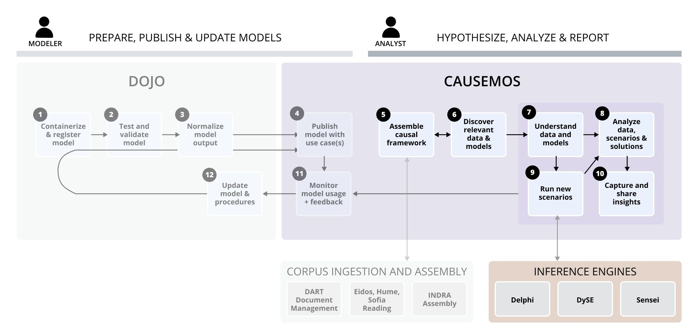

# Qualitative Analysis Toolkit

The Causemos HMI supports a qualitative Causal Analysis Graph (CAG)
assembly workflow that allows analysts to leverage automatically
processed literature to identify the main drivers and relationships for
target concepts.

CAGs can be turned into semi-quantitative computational models used to
analyze different scenarios and interventions. In this scenario analysis
workflow, available data (see [Quantitative Analysis](bu-quant-systems.html) for
more information) is automatically mapped to concepts. While
quantification is not required for scenario analysis, when included it
allows World Modelers engines to infer the nature and strength of
relationships in the CAG. To validate the mapped defaults and resolve
any data quality issues, the system solicits analysts to provide their
own human judgment.

A parameterization of the semi-quantification computational models is
sent to the three inference engines ([DySE](td-modeling/dyse.html),
[Delphi](td-modeling/delphi), [Sensei](td-modeling/sensei.html)) to create models and project
the baseline for the selected timescale (months or years). Projections
visualized in [Causemos](td-modeling/causemos.html) are meant to provide a sense of
directionality of trends and whether changes are small or large
(especially compared to historical dynamics), and account for all the
influences in the complex system. Analysts can apply "clamps" to future
values for one or more drivers, to simulate interventions or specific
worst case/best case scenarios, see cascading impacts across the system,
and compare to baseline trends. An explicit representation of the system
makes levers available for interventions more explicit and supports
creative thinking. This helps mitigate framework issues and encourages
analysts to consider possible hindrances to interventions and their
unanticipated effects.