# Qualitative Analysis in Causemos

The following workflow example illustrates how analysts can leverage
suggestions, evidence, and relationships to quickly augment their mental
models.

Assemble the CAG (leveraging tools from the Corpus Ingestion and
Assembly Toolkit), and augment your concepts and relationships with
system suggestions from the knowledge base.

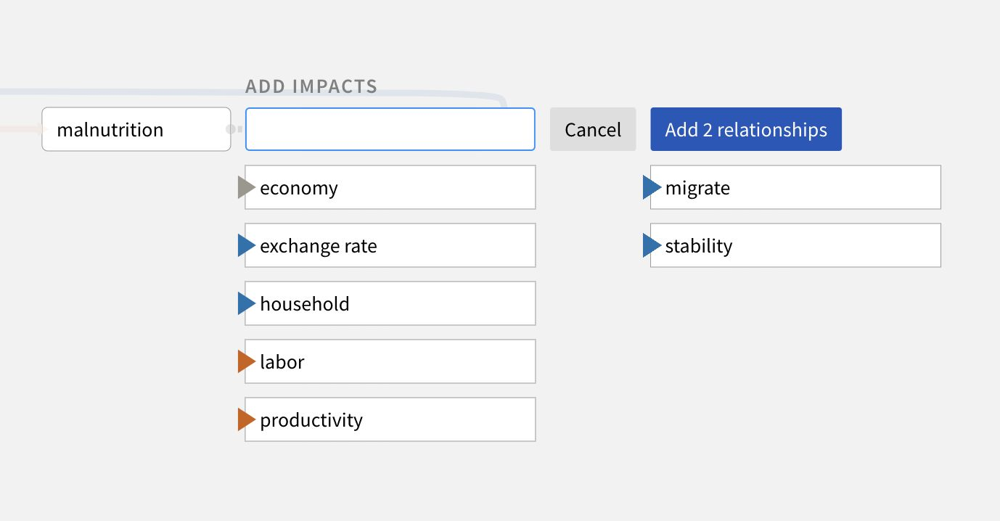

Click a relationship to review underlying relationship evidence
automatically retrieved from the knowledge base.

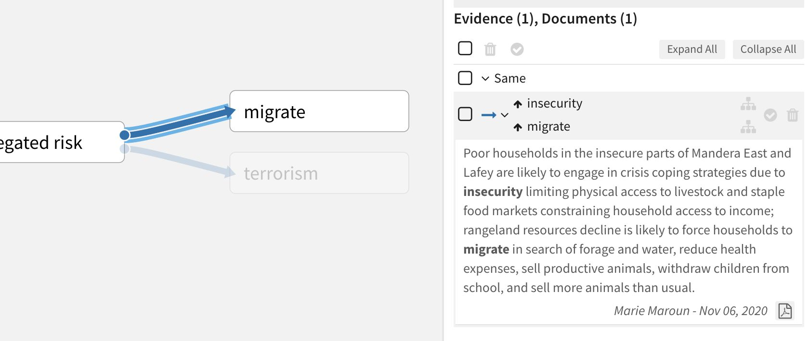

For full context, click a reference in the Evidence panel to open the
source document from which it was extracted.

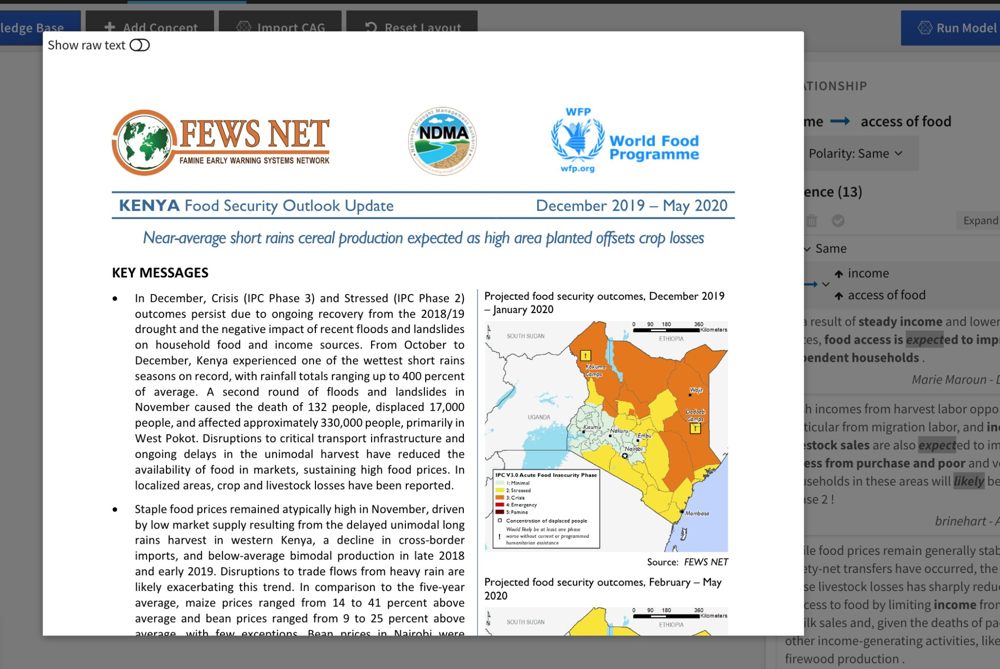

Click **Search Knowledge Base** to discover new relationships in the
knowledge base explorer. Review the Knowledge Base facets to get a sense
of the types of available documents, relationships, and evidence
quality. Click any of the values to filter the visible data in the
knowledge base explorer.

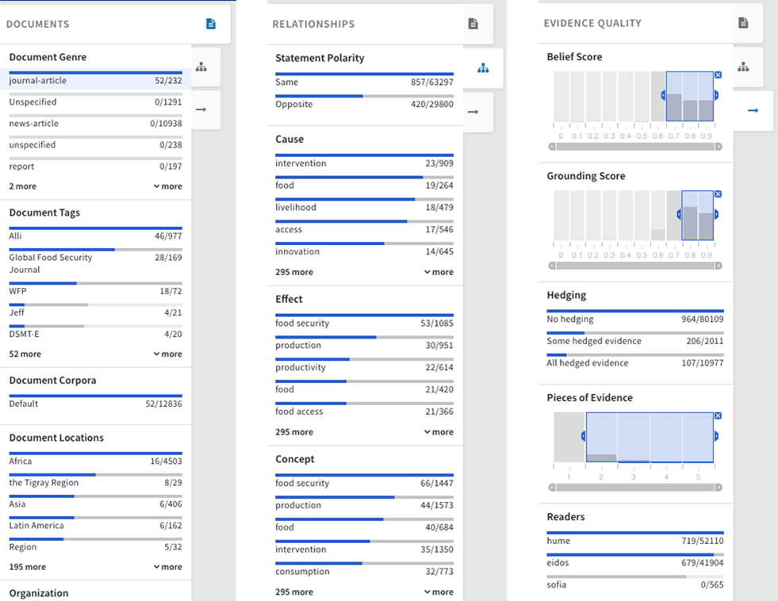

Select relationships in the Graph view of the knowledge base to add them
to the CAG.

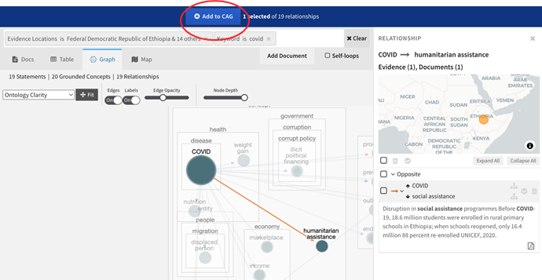

## CAQ Quantification

Quantification makes qualitative models less subjective, enabling the
system to infer the nature of the relationships. The system provides a
head start on quantification by automatically matching datacubes to
concepts. However, human judgment is needed to validate the defaults and
resolve any data quality issues.

The following workflow examples illustrate the process of quantifying a
CAG and performing a scenario analysis with quantified nodes.

When an analyst begins to **Analyze Scenarios**, the system
automatically matches datacubes to the concepts in the CAG. Nodes with
yellow backgrounds indicate old or insufficient data.

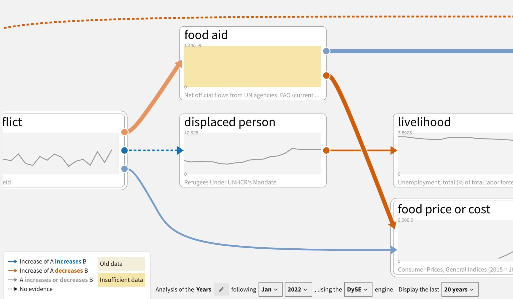

Analysts can drill down on data quality issues by double click the
affected node to see more details.

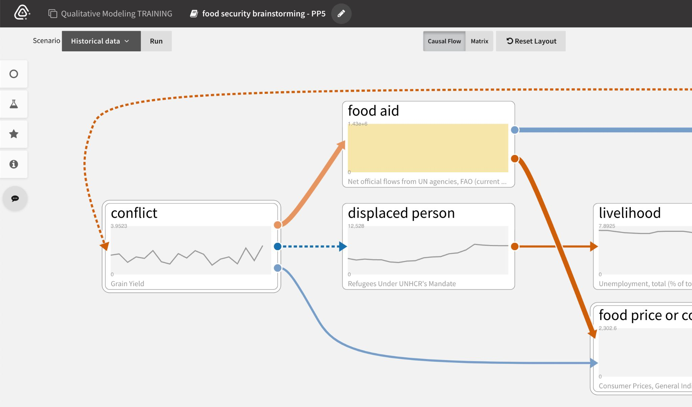

Different corrective actions are available depending on the quality
issue. If the data is:

-   Incorrectly mapped, analysts can **Choose a different datacube** by
    searching and filtering the datacube explorer.
    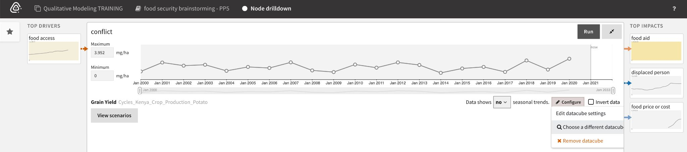
-   Insufficient (has very few data points), analysts can **View
    suggestions** of other relevant datacubes to use.
    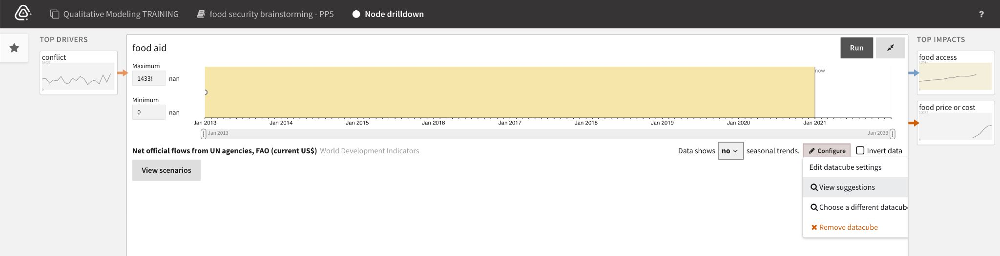
-   Old, analysts can manually fill gaps with prior knowledge and **Save
    parameterization changes**.
    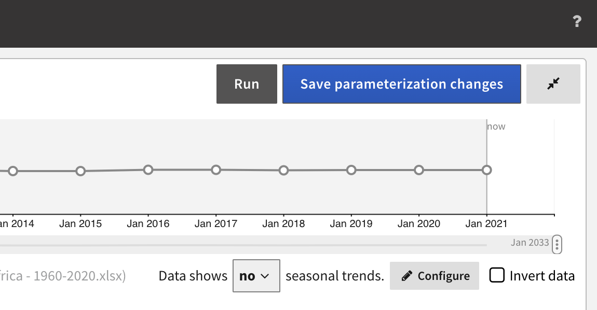

To find relevant data to replace insufficient or incorrectly mapped
datacubes, analysts search the available datacubes or filter them using
the facets.

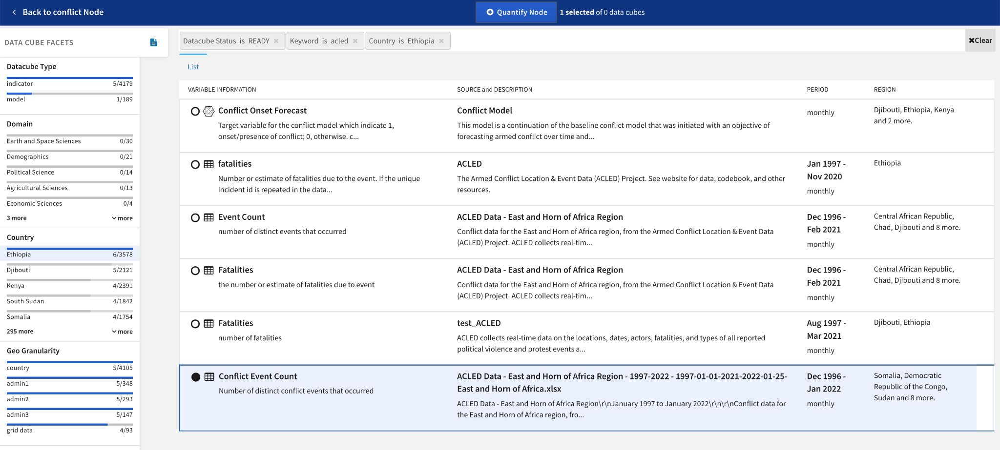

The Breakdown panel for a selected datacube lets analysts specify its
spatial scope before quantifying the node.

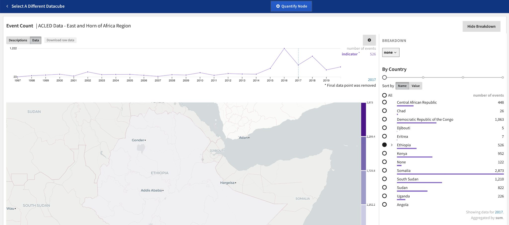

## Projections

Projections in the scenario analysis workflow allow analysts to see the
distribution of results at various time intervals. Running projections
utilizes the inference engines DySE, Delphi, and Sensei (see individual
engine sections for more information about their methodology).

**Note**: Projections are trends based on incoming influences, not
accurate predictions.

Baseline scenarios have trends, projection time slices, and different
types of relationships.

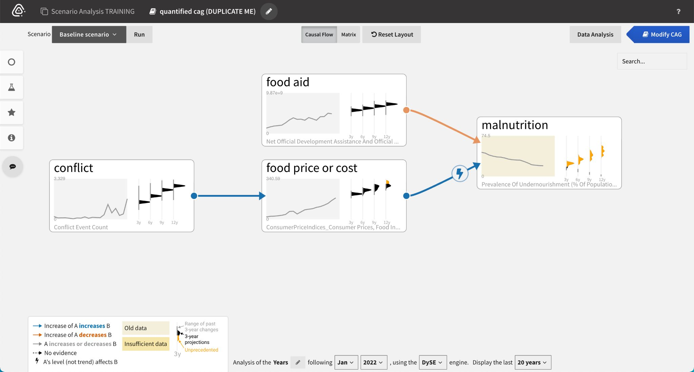

Historical data mapped to nodes is used by inference engines to:

-   Set the range of possible values (max - min and buffer top and
    bottom).
-   Situate the initial value for the projections in that range.
-   Infer the nature of edges

The system produces trends for 'head' nodes only. 'Head' nodes are those
that do not have any incoming/upstream causal drivers.

![Trends inferred from historical data (black) and resulting from incoming influences (orange).]

Historical context ranges provide a notion of how realistic the
projections are (based on whether such changes over the time window have
been seen historically).

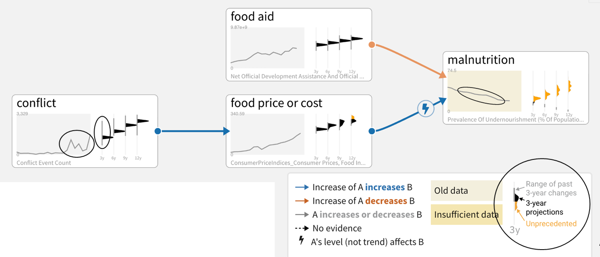

## Sensemaking

Causemos supports many sensemaking capabilities that help analysts
better understand large CAGs. Below are some examples of ranking and
visualizing node sensitivity, influential paths, and feedback loops.

To understand node sensitivity in larger CAGs, we utilize the DySE
engine's Sensitivity Analysis capability (see the DySE section for more
technical details):

1.  Select a node (**malnutrition** in this case, which is increasing)
    to rank its Top Drivers.
2.  Review the list of drivers. In this example, **conflict** is more
    responsible for **malnutrition** than **climate change** is.
3.  Select a driver (**conflict**) to see all the paths between it and
    the selected node (**malnutrition**).

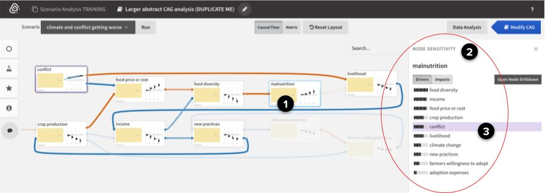

To find the most influential paths between two nodes in larger CAGs, we
utilize the DySE engine's Pathway Analysis capability (see the DySE
section for more technical details):

1.  Open the Analytics panel.
2.  Select **Analysis: Influence Paths**.
3.  Select a **Source** (**conflict**) and **Target**
    (**malnutrition**), and then click **Run pathway sensitivity**.
4.  From the ranked list of paths, select a path to highlight it in the
    CAG.

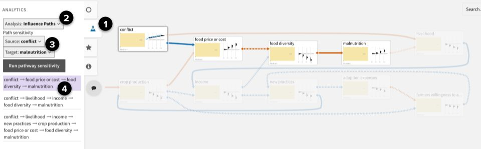

To find feedback loops in larger CAGs:

1.  Open the Analytics panel.
2.  Select **Analysis: Feedback Loops**.
3.  From the ranked list of loops, select a balancing or reinforcing
    loop to highlight it in the CAG.

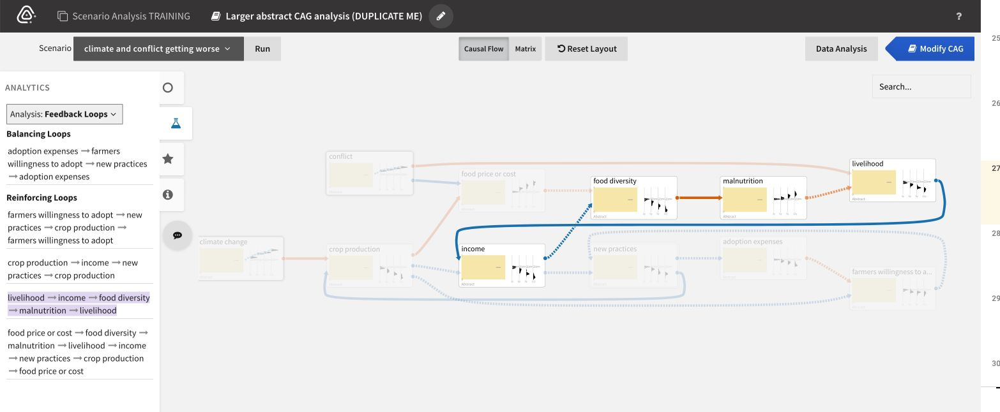