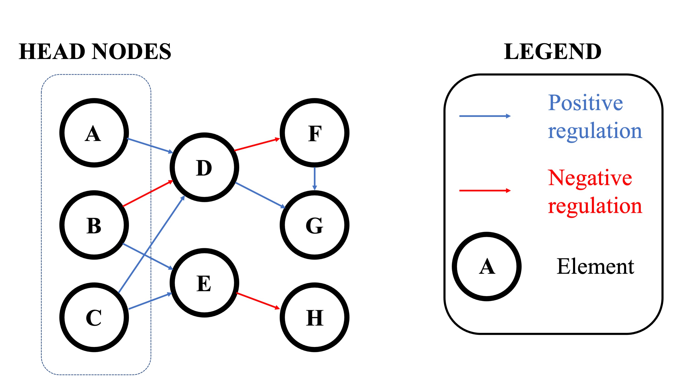
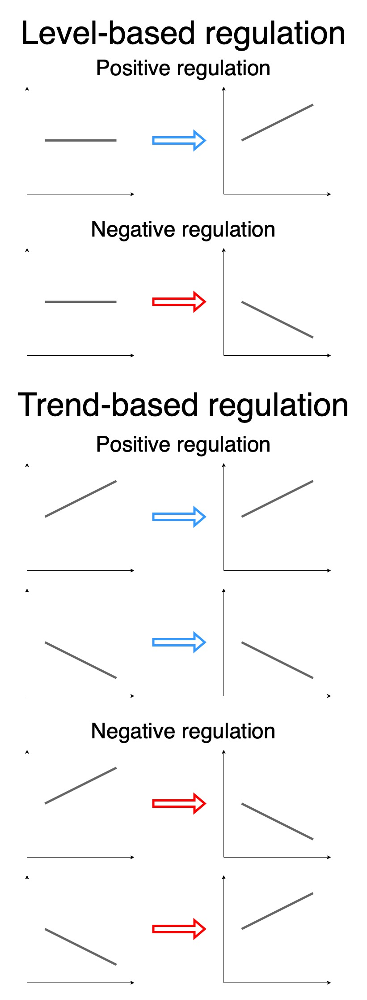
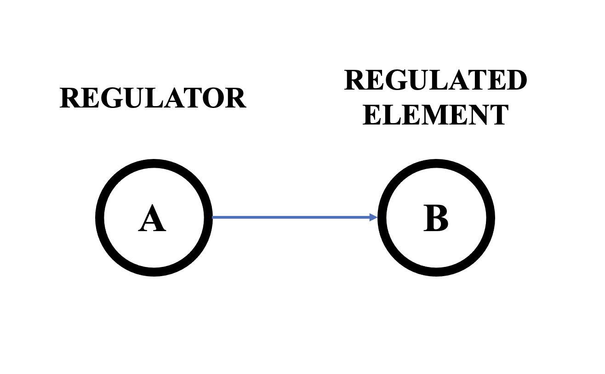
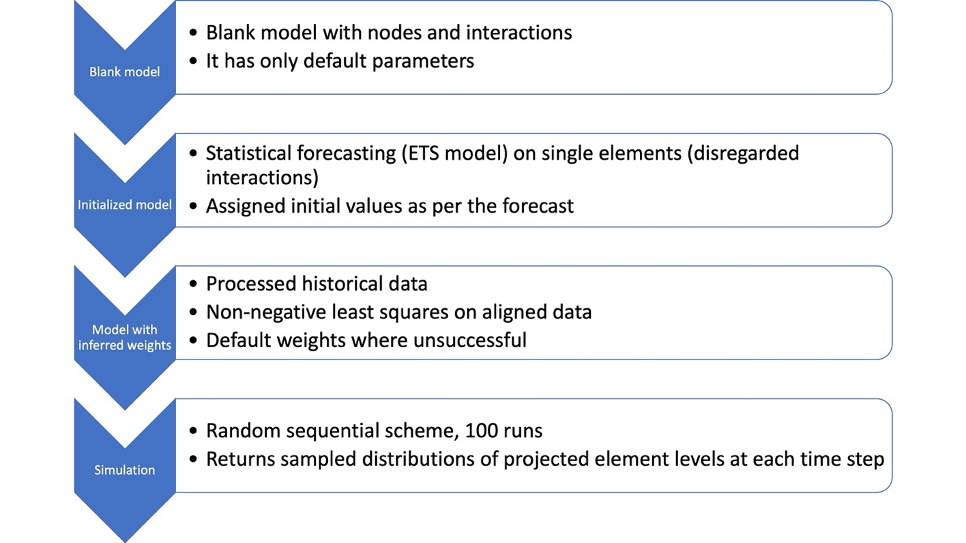
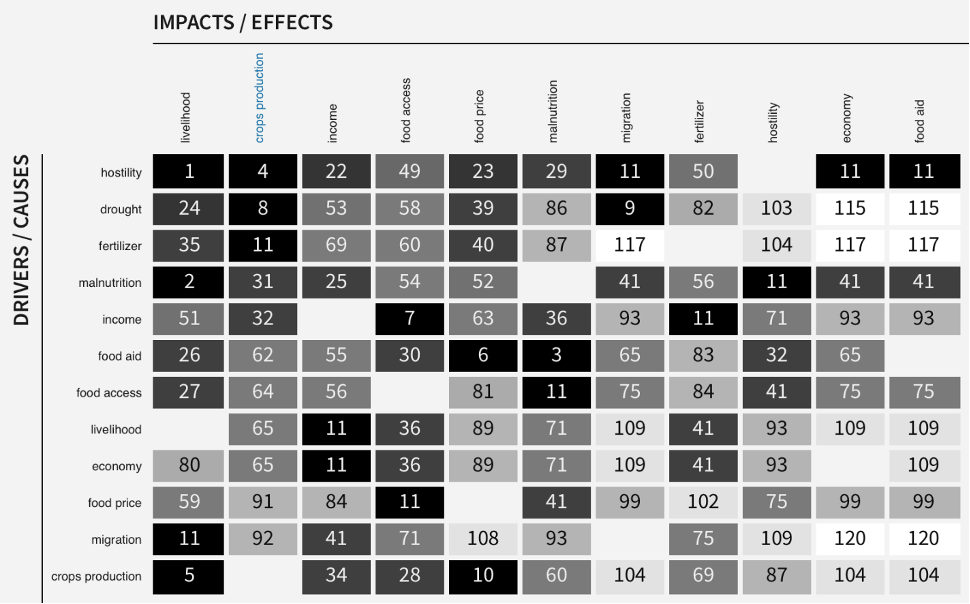
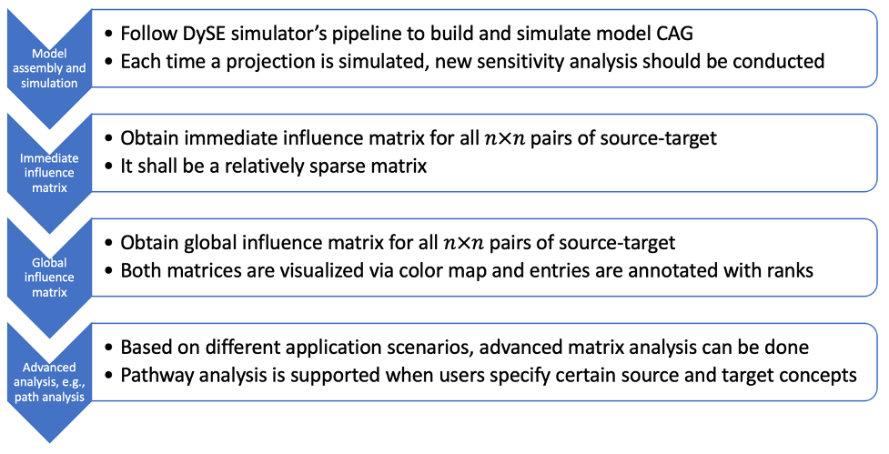
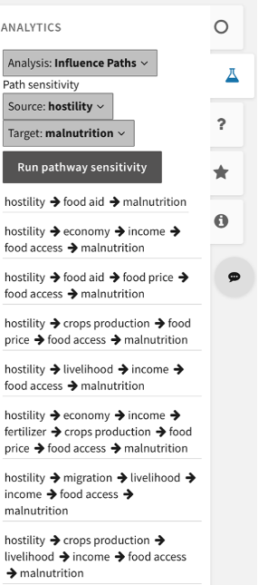

# DySE

[DySE](https://github.com/zgxlhy/dyse_wm) (Dynamic Systems Explanation) is a framework for studying dynamics in systems representable as networks of interacting modules. 

## 1. DySE Simulator

#### About

The DySE simulator is a discrete state network model projection tool which leverages directed interaction graphs to simulate how influences propagate in complex systems. In the graph, each node represents a single concept, and each directed edge represents an interaction/influence. It is used in a wide range of modeling challenges where the interactions between system components play a dominant role, in contrast to individual component behaviors. There are two types of supported influences: level-based regulation where a level of an element (regulator) is influencing the target element, and trend-based regulation where trend (difference between the current and the previous level) is considered instead.

 

Fig. 1: An example of DySE model underlying network

The interactions can have either positive or negative polarity. Positive level-based regulation increases the target element's level proportionally to the level of the regulator, while negative level-based regulation decreases it. With positive trend-based regulation an increase in the regulator causes an increase in the regulated element (target), while a decrease in the regulator causes a decrease in the regulated element. The opposite happens with negative trend-based regulation: an increase in the regulator results in a decrease in the regulated element, while a decrease in the regulator results in an increase in the regulated element.

 

Fig. 2: DySE regulation types

#### Method description

Model element is a node with a discrete variable (level). Each element in the model is described with several mandatory fields:
1. Element IDs: ontology node that an element is grounded to
2. Variable: element alias which conforms to a preset notation (alphanumeric starting with a letter, allowing only underscores as an exception)
3. Levels: number of discrete levels (default: 31 in CauseMos for all elements)
4. Positive: expression for the update function which encodes positive influences on the element
5. Negative: expression for the update function which encodes negative influences on the element
6. Initial 0: initial level value and encoded constraints (user-clamped values at specified simulation time steps)

 

Fig. 3: Element naming convention with respect to the interaction between them

Simulations are run in discrete time steps, where, during each time step a single element with a non-empty set of regulators is arbitrarily selected to be updated (i.e., a random sequential simulation scheme). The selected element has its level updated according to the update function value, defined in the model spreadsheet (DySE simulator input file). The update function takes two numerical arguments for each regulator: level and trend (difference between current and last observed level). The strength of the regulator influence is defined by parameters we refer to as level weight and trend weight. For more details, refer to the DiSH-trend simulator publication.

#### Inputs

DySE simulator takes the model in Excel spreadsheet format (.xlsx files) as the input argument, where each row corresponds to a single model element. Alternatively, DySE provides a functionality to create model spreadsheet from a CauseMos model dump and projection request JSON files to initialize model parameters and values.

The model format that DySE takes as input, includes the structure of the network, as well as time series data associated with each node in the network.

Other required arguments (hyperparameters) are:
* Runs: number of simulations runs, i.e., sampled trajectories per element (default: 100)
* Steps: number of simulation time steps (arbitrary time units) 

#### Outputs

The simulation output is a traces.txt file which contains all simulated runs’ records. DySE provides an additional feature that processes this file, and returns sampled distributions of each element’s level, at each simulation time step.

#### Pipeline

Alongside the simulator, DySE provides utilities for preprocessing historical data to initialize models. It identifies head nodes (nodes that are not influenced by any of the model nodes, including themselves, see Fig. 1), performs statistical forecasting based on linear additive ETS (error, trend, seasonal) models and using historical data, and constrains the head node values throughout the simulation timespan to ensure that the simulation scenario is plausible and relevant.

Weights inference is challenging, as many of the nodes in the network can have missing or poor-quality data. Typically, these are treated with Bayesian inference, but this approach could be considered too slow for practical purposes. To find a balanced solution, DySE has a graph crawling utility algorithm which aligns time grids of the influence sets and their regulated elements and performs local non-negative linear regression fits wherever possible. If weight inference from data is impossible, DySE assigns defaults of trend weight equal to 0.5, and level weight equal to 0.

Fig. 4: DySE simulator workflow

## 2. Sensitivity and Pathway Analysis
### 2.1 Sensitivity Analysis

#### About

Sensitivity analysis in DySE can provide a perspective of quantifying the influences between cause-and-effect concepts (in DySE, we denote concepts as elements), subject to the structure of a complex system and its initial states, as well as applied intervention strategies. In the causal analysis graph (CAG) , each directed edge represents an interaction between connected concepts, therefore concepts shall have local influence on its directly connected concepts, and global influence on downstream nodes that are connected through indirect paths. Sensitivity analysis aims to quantify these influences and make them comparable within the CAG and across different CAGs.

#### Method description

Each element in the model is updated as per its discrete update function, which is in general a linear combination of polynomial functions of regulator-based arguments: regulator levels, and regulator trends. In some cases, a change in a regulator (upstream node) does not always lead to the change of the regulated element (directly connected downstream node).

We define immediate influence from a ‘cause’ element to an ‘effect’ element as the “normalized” expected value of the magnitude of the change in the downstream ‘effect’ element when there is small perturbation on the ‘cause’ element, calculated from the joint element distribution estimated from their projections. The term “normalized” means that we normalize the change magnitude of an element by its maximum range. It is obvious that immediate influence only occurs in a directly connected element pair, and normalization makes the influence fall into the range of [0,1]. The higher the influence value is, the more likely or of larger magnitude the ‘effect’ element will change, when the ‘cause’ element changes.

To this end, we further define global influence along a given path (if it exists) between a ‘cause’ element to an ‘effect’ element, as the propagation of the immediate influence along the path. We define overall global influence as the summation of global influences across all possible paths between the cause-effect pair.

Analysis Types: In DySE, we support two types of sensitivity analysis types, namely static analysis, and dynamic analysis (the default in CauseMos). They are only different with respect to the expected value being calculated from different joint element distributions. Static analysis assumes uniform joint element distributions, whereas dynamic analysis estimates joint element distributions from projection results. Static sensitivity analysis is only determined by the structure of the CAG, but the dynamic version also depends on the CAG’s initial states and applied interventions.

Implementation Types: To balance the running speed and analysis accuracy, we implement the algorithm, for both analysis types, in two ways, i.e., function-based (FB) and hybrid-based (HB, default in CauseMos). These two types of implementations end up with slightly different results. The FB method approximates the immediate influence in a smart way without projection results; it estimates the influence via a linear function of regulator weights and runs very quickly. With the HB method, the immediate influences of most elements are calculated by taking all possible joint states of the projection into account. Consequently, the HB method is highly dependent on projection results that are essentially shaped by initial states and applied interventions, but it is slow in speed due to the enumeration of all possible joint states. In comparing the FB and HB implementations, the HB method is slower, but more accurate.

#### Inputs

* The output of DySE simulator (i.e., projection results).
* The implementation type (choose between FB and the default HB)

#### Outputs

* One output is an immediate influence matrix of size n\times n, where n is the number of nodes. The rows of this matrix represent source nodes, and the columns represent target nodes. The entries of this matrix denote the immediate influence from any source to any target element.
* One output is a global influence matrix of size n\times n.  The rows of this matrix represent source nodes, and the columns represent target nodes. The entries of this matrix denote the global influence from any source to any target element. Since immediate influences only occur within directly connected pairs, global influences are available for remote pairs and therefore the global influence matrix is denser.

Note that in CauseMos, these matrices are visualized via a colormap, and entries are annotated by their rank within the matrices. In the colormap, the darkness of an entry suggests the magnitude of the influence, the annotated number is the order of the influence magnitude among all influences, ranking from the highest to the lowest. In the DySE engine, the returned matrices are alphabetical in the order of element names, but the CauseMos interface also provides flexibility of ranking them by a certain row or column. For example, the users can sort the matrix by the most impact on crops production via clicking ‘crops production’ on the ‘impact’ row.

Fig. 5: An example of influence matrix shown as a colormap in CauseMos interface

#### Pipeline

Users start with a CAG assembled from concepts and interactions. Users then assign weights and initial values , and then run DySE’s projection engine to forecast the change curve for concepts of interest. After this point, sensitivity analysis can be conducted to obtain an immediate influence matrix and then a global influence matrix. The returned matrices are visualized in the CauseMos interface. Each time a user changes the CAG (e.g., CAG structure, weight values or initial values), new matrices will be generated accordingly.
 

Fig. 6: Pipeline of sensitivity and path analysis in DySE engine

### 2.2 Pathway Analysis

#### About

Pathway analysis in DySE is built on sensitivity analysis, specifically the immediate influence matrix. A path score can be assigned to a path consisting of all elements from the source to the target element, measuring how likely or strongly the source’s change can be propagated to the target.

#### Method description

With an immediate influence matrix of size n\times n, we can define a path score for any particular path, as the product of immediate influences along the path. Immediate influence behaves like probability and therefore calculating the influence along a path, is subject to chain propagation – this is the reason we multiply the immediate influence of all segments in the path.

Pathway analysis can be built on both analysis types (static and dynamic), as well as both implementation types (FB and HB).

Considering the range of immediate influence and the chain multiplications, the path score is usually a positive decimal value significantly smaller than 1.0 (the upper bound is theoretically 1). The DySE engine outputs the negative logarithm of path score, i.e., -log(score) , whose range is [0, +\infty). The smaller this value is, the higher the influence suggested by the path.

#### Inputs

* One input of DySE pathway analysis is the output of DySE sensitivity analysis (i.e., immediate influence matrix) 
* Source concept(s) of interest (one or multiple)
* Target concept(s) of interest (one or multiple)
* Number of paths the user wants to extract

#### Outputs

Based on different use cases, a number of paths from any source(s) to any target(s) are returned, ranked by path score denoting the impact extent of the path. Common variants of outputs include:
* Top paths from one source to one target
* Top paths from multiple sources to one target
* Comparisons among paths for same source-target pair, but under different initial values or different intervention strategies.

Note that in CauseMos interface, the pathway analysis is located at ‘ANALYTICS > > Influence Path’ on the left menu bar, top paths from one source to one target will be generated, ranked by the path score from the smallest to the largest (i.e., from the most influential to the least). When the user clicks on a path in the list, that path will be highlighted in the CAG.
 

Fig. 7: An example of pathway analysis result in CauseMos

See Pipeline in Sensitivity Analysis section

After the dataflow of DySE sensitivity analysis, user can specify source(s) and target(s) concepts, as well number of paths, and the engine will return top paths and their corresponding path scores. Each time the user changes the CAG (e.g., CAG structure, weight values or initial values), new paths will be generated accordingly.

## Citation

If you are using DySE in academic publication, please cite papers [1], [2], [5], and [6] from the References section.

## References

[1] Sayed, K., Kuo, Y. H., Kulkarni, A., & Miskov-Zivanov, N. (2017, December). DiSH simulator: Capturing dynamics of cellular signaling with heterogeneous knowledge. In 2017 Winter Simulation Conference (WSC) (pp. 896-907). IEEE. doi: 10.1109/WSC.2017.8247841.

[2] Andjelkovic, S., & Miskov-Zivanov, N. (2021, December). DiSH-trend: Intervention Modeling Simulator That Accounts for Trend Influences. In Winter Simulation Conference (WSC). IEEE. doi:10.1109/WSC52266.2021.9715401 

[3] Sayed, K., Telmer, C. A., Butchy, A. A., & Miskov-Zivanov, N. (2017, September). Recipes for translating big data machine reading to executable cellular signaling models. In International Workshop on Machine Learning, Optimization, and Big Data (pp. 1-15). Springer, Cham.

[4] Telmer, C. A., Sayed, K., Butchy, A., Bocan, K. N., Holtzapple, E., Hansen, C. E., ... & Miskov-Zivanov, N. (2019, May). Dynamic system explanation: DySE, a framework that evolves to reason about complex systems-lessons learned. In Proceedings of the Conference on Artificial Intelligence for Data Discovery and Reuse (pp. 1-10).

[5] Zhou, G., Liang, K. W., & Miskov-Zivanov, N. (2019). Intervention Pathway Discovery via Context-Dependent Dynamic Sensitivity Analysis. arXiv preprint arXiv:1902.03216.

[6] Zhou, G., Liang, K. W., & Miskov-Zivanov, N. (2018, August). Sensitivity Analysis of Discrete Models and Application in Biological Networks. In Proceedings of the 2018 ACM International Conference on Bioinformatics, Computational Biology, and Health Informatics (pp. 605-606).
